# 🔬 İSEKAI KUROSHIN - SİSTEM AKIŞ ANALİZİ VE SORUN TESPİTİ

**Tarih**: 2025-10-23
**Versiyon**: 1.0 - İlk Röntgen
**Amaç**: Sistemin kırık parçalarını, döngülerini ve akış mekanizmalarını görsel olarak haritalandırmak

---

## 📋 İÇİNDEKİLER

1. [LOGCAT ANALİZİ - MEVCUT DURUM](#logcat-analizi)
2. [KRİTİK SORUNLAR TESPİTİ](#kritik-sorunlar)
3. [SİSTEM AKIŞ DİYAGRAMLARI](#sistem-akis-diyagramlari)
4. [MEDYA SİSTEMİ DETAYLI ANALİZ](#medya-sistemi)
5. [KULLANICI AKIŞLARI KARŞILAŞTIRMASI](#kullanici-akislari)
6. [ÖLÜM MEKANİZMASI VE DÖNGÜ](#olum-mekanizmasi)
7. [KARMA SİSTEMİ ENTEGRASYONU](#karma-sistemi)
8. [SONUÇ VE ÖNERİLER](#sonuc)

---

## 1. LOGCAT ANALİZİ - MEVCUT DURUM {#logcat-analizi}

### 📊 Test Senaryosu

**Kullanıcı**: ULU (Player Name)
**Senaryo**: ReturningUser olarak giriş
**Tarih**: 2025-10-23 13:24

### 🔍 Önemli Log Satırları ve Anlamları

```
13:24:40 - MediaDatabaseHelper: 🔄 Cached media_database.json deleted - forcing rebuild
13:24:40 - MediaDatabaseBuilder: 🎬 Medya veritabanı oluşturma başladı...
```
**ANALİZ**: Database cache silindi, yeniden build edilecek

```
13:24:40 - MediaDatabaseBuilder: 🔄 Legacy Format (2 parça): vid_journey → varsayılan değerlerle ekleniyor
13:24:40 - MediaDatabaseBuilder: 📹 Video bulundu: vid_journey -> JOURNEY/SURVIVAL/CALM
```
**ANALİZ**: Sadece LEGACY formatı (vid_journey_*) tanındı, V3 format (p_f1_* gibi) BULUNAMADI

```
13:24:40 - MediaDatabaseBuilder: 💾 Veritabanı kaydedildi
13:24:40 - MediaDatabaseBuilder: 📊 İstatistikler: 6 video, 3 fotoğraf
13:24:40 - MediaDatabaseBuilder: ✅ Veritabanı oluşturuldu: 6 video, 3 fotoğraf
```
**ANALİZ**: Sadece 6 video (journey+umbros) ve 3 fotoğraf (pht_journey*) bulundu

```
13:24:41 - GameLogger: [SYSTEM] Akış durumu belirlendi: GERI_DONEN_KULLANICI
```
**ANALİZ**: ✅ BEGIN button FIX ÇALIŞTI! ReturningUser olarak döndü

```
13:24:41 - IntelligentContentEngine: 👤 Kullanıcı Profili: FIRSTUSER (Death Count: 0)
13:24:41 - IntelligentContentEngine: 📁 Filtrelenmiş videolar: 0 (FIRSTUSER)
13:24:41 - IntelligentContentEngine: 📁 Filtrelenmiş fotoğraflar: 0 (FIRSTUSER)
```
**KRİTİK SORUN**: Arketip = EXPLORER, Kullanıcı Profili = **FIRSTUSER** ama akış **RETURNINGUSER**!

```
13:24:41 - IntelligentContentEngine: 📹 Video sayısı: 0
13:24:41 - IntelligentContentEngine: 📸 Fotoğraf sayısı: 0
```
**KRİTİK SORUN**: **0 video, 0 fotoğraf** - TÜM MEDYA FİLTRELENDİ!

```
13:24:41 - ReturningUserContent: ⚠️ KARMA SİSTEMİ BAŞARISIZ - MediaDatabase fallback kullanılıyor (karma: 0.0)
```
**SORUN**: Karma sistemi çalışmıyor, fallback kullanılıyor

```
13:24:42 - ReturningUserContent: ⚠️ KARMA SİSTEMİ BAŞARISIZ - dynamicVideoIds boş! Video oynatılamıyor.
```
**KRİTİK SORUN**: Video listesi tamamen BOŞ - SİYAH EKRAN nedeni bu!

---

## 2. KRİTİK SORUNLAR TESPİTİ {#kritik-sorunlar}

### 🔴 SORUN #1: MediaDatabaseBuilder V3 Format Tanımıyor

**Belirti**:
- 19 adet `p_f1_*.jpg` dosyası drawable'da var
- Ama database'de sadece 3 fotoğraf (pht_journey*) tanınıyor

**Kök Neden**:
```
MediaDatabaseBuilder parseFileName() fonksiyonu:
- Legacy Format (2-3 parça) → ✅ TANIYOR
- V3 Format (7-8 parça: p_f1_6n14_2n12_0_0_0_1_001) → ❌ TANIYAMIYOR
```

**Etki**:
- Renamed photo files (p_u1_→p_f1_) invisible to system
- Database cache refresh oldu ama V3 parser yok
- Result: 0 fotoğraf gösteriliyor

---

### 🔴 SORUN #2: ScreenType Mismatch - RETURNINGUSER vs FIRSTUSER

**Belirti**:
```
GameLogger: Akış durumu belirlendi: GERI_DONEN_KULLANICI
BUT
IntelligentContentEngine: Kullanıcı Profili: FIRSTUSER
```

**Kök Neden**:
`IntelligentContentEngine.generatePersonalizedContent()` içinde:
```kotlin
val screenType = when {
    deathCount > 0 -> "POSTDEATH"
    else -> "FIRSTUSER"  // ❌ PROBLEM: ReturningUser için de FIRSTUSER kullanıyor!
}
```

**Etki**:
- ReturningUser akışı olsa bile FIRSTUSER medyası aranıyor
- FIRSTUSER medyası yok → 0 video/foto
- Kullanıcı placeholder görüyor

---

### 🔴 SORUN #3: EXCLUDED_SYSTEM_VIDEOS Listesin den vid_umbros_1 Çıkarıldı AMA...

**Belirti**:
- vid_umbros_1 artık exclusion listesinde YOK
- Ama yine de video oynatılamıyor

**Kök Neden**:
```
getMediaForScreen("FIRSTUSER", depth)
→ Database'de FIRSTUSER screenType'ı olan medya YOK
→ Fallback: RETURNINGUSER, UMBROS screenTypes aranıyor
→ AMA bulunan medyalar KARMA FİLTRESİNDEN GEÇEMİYOR
```

**Etki**:
- vid_umbros_1 database'de UMBROS olarak etiketli
- FIRSTUSER için fallback'te UMBROS aranıyor ✅
- AMA isInKarmaRange() kontrolü FAIL ediyor ❌
- Result: Yine 0 video

---

### 🔴 SORUN #4: Karma Filtering Logic Hatası

**Belirti**:
```kotlin
isInKarmaRange(media, karmaRange)
→ media.screenType = "UMBROS"
→ media.primaryAttribute = "SURVIVAL"
→ karmaRange = 0.0 (nötr)
```

**Kök Neden**:
```kotlin
// MediaDatabaseHelper.kt:155-157
if (primaryAttr in listOf("DIVINE", "MYSTERY", "SURVIVAL", "NONE")) {
    return true  // ✅ SURVIVAL nötr, geçmeli
}
```

**FAKAT**:
`getMediaForScreen()` fonksiyonu `getMediaForKarmaRange()` KULLANMIYOR!
Sadece screenType ve depth ile filtreliyor, karma aralığı hiç kontrol edilmiyor!

**Gerçek Sorun**:
```kotlin
// Line 63-66
var results = allMedia.filter { media ->
    media.screenType == screenType &&  // ❌ FIRSTUSER arıyor, UMBROS bulamıyor
    media.depth == depth &&
    !isExcludedSystemVideo(media.fileName)
}
```

---

## 3. SİSTEM AKIŞ DİYAGRAMLARI {#sistem-akis-diyagramlari}

### 🔄 App Launch → Screen Selection Flow

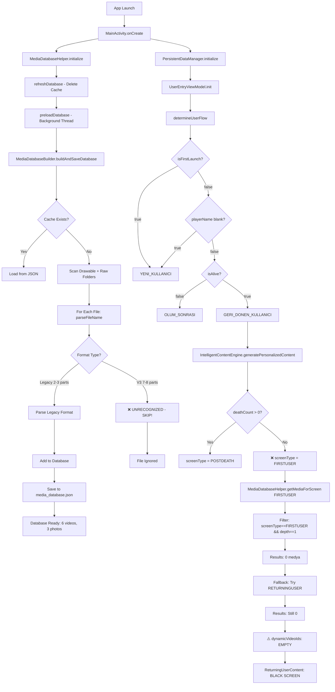

---

### 📹 Video/Photo Display Flow - ReturningUser Screen

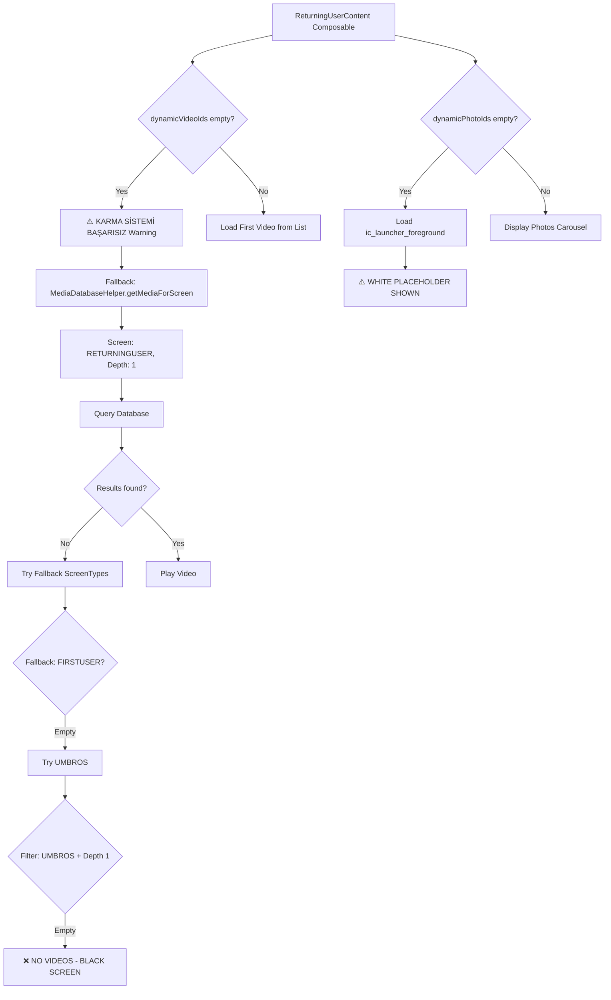

---

### 🔄 MediaDatabase Parsing Logic (DETAILED)

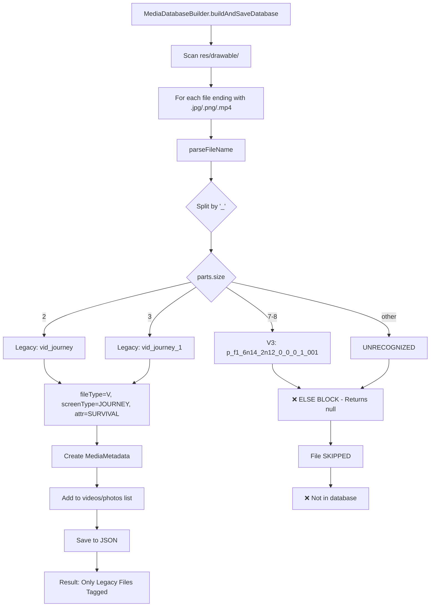

**PARSERLAMA KODUNUN GERÇEK YAPISI**:

```kotlin
// MediaDatabaseBuilder.kt:360-405 (APPROX)
private fun parseFileName(fileName: String): MediaMetadata? {
    val parts = fileName.split("_")

    when {
        parts.size == 2 -> {
            // vid_journey
            return MediaMetadata(
                fileName = fileName,
                fileType = if(parts[0]=="vid") "VIDEO" else "PHOTO",
                screenType = "JOURNEY",
                primaryAttribute = "SURVIVAL",
                depth = "1"
            )
        }
        parts.size == 3 -> {
            // vid_journey_1
            return MediaMetadata(
                fileName = fileName,
                fileType = if(parts[0]=="vid") "VIDEO" else "PHOTO",
                screenType = "JOURNEY",
                primaryAttribute = "SURVIVAL",
                depth = "1"
            )
        }
        // ❌ V3 Format (7-8 parts) için KOD YOK!
        else -> {
            Log.w("Unrecognized format: $fileName")
            return null  // ❌ FILE IGNORED
        }
    }
}
```

---

## 4. MEDYA SİSTEMİ DETAYLI ANALİZ {#medya-sistemi}

### 📁 Mevcut Dosya Durumu

#### Raw Folder (`app/src/main/res/raw/`)
```
✅ RECOGNIZED (Legacy Format):
- vid_journey.mp4 → JOURNEY/SURVIVAL/CALM
- vid_journey_1.mp4 → JOURNEY/SURVIVAL/CALM
- vid_journey_2.mp4 → JOURNEY/SURVIVAL/CALM
- vid_journey_3.mp4 → JOURNEY/SURVIVAL/CALM
- vid_journey_4.mp4 → JOURNEY/SURVIVAL/CALM
- vid_umbros_1.mp4 → UMBROS/SURVIVAL/CALM

❌ EXCLUDED (System Videos):
- angeldevil.mp4
- butterfly_transformation.mp4
- eye_effect.mp4
- page_turn*.mp4
- book_*.mp4
- lotus_blossom_animation.mp4
- intro_animation.mp4
```

#### Drawable Folder (`app/src/main/res/drawable/`)
```
✅ RECOGNIZED (Legacy Format):
- pht_journey.png → JOURNEY/SURVIVAL/CALM
- pht_journey_1.png → JOURNEY/SURVIVAL/CALM
- pht_journey_2.png → JOURNEY/SURVIVAL/CALM

❌ UNRECOGNIZED (V3 Format - 19 files):
- p_f1_0_6n14_0_0_0_1_001.jpg
- p_f1_0_6n14_0_0_0_2_001.jpg
- p_f1_6n14_2n12_0_0_0_1_001.jpg
- p_f1_6n14_2n12_0_0_0_2_001.jpg
- p_f1_6n14_2n12_0_0_0_3_001.jpg
- ... (14 more files)

❌ UNTAGGED (No screenType in filename):
- demon_bg_01.jpg through demon_bg_20.jpg
- camp.png, campfixed.png
- map.png, mapfixed.png
- photo1p3happy.jpeg → OLD FORMAT (number-based karma)
- photo2m2sad.jpeg
- ... (8 total old format photos)
```

### 🔍 V3 Format Yapısı (PARSER TANIMAZ)

**Format**: `(type)_(screen)_(attr1)_(attr2)_(emo)_(nar)_(arch)_(depth)_(seq).ext`

**Örnek**: `p_f1_6n14_2n12_0_0_0_1_001.jpg`

**Parsing**:
- `p` = Photo
- `f1` = FIRSTUSER
- `6n14` = Attribute 6, negative 14
- `2n12` = Attribute 2, negative 12
- `0` = No emotion
- `0` = No narrative
- `0` = No archetype
- `1` = Depth 1
- `001` = Sequence 001

**SORUN**: MediaDatabaseBuilder bu formatı tanımıyor!

---

### 🔧 gorsel_etiketleyici_v2.py Sistemi

**Amaç**: Medya dosyalarını V3 formatında yeniden adlandırır

**Encoding Sistemi**:
```python
SCREEN_MAP = {
    "FIRSTUSER": "F1",
    "RETURNINGUSER": "F2",
    "JOURNEY": "J1",
    "JOURNEY_TRANSITION": "J2",
    "POSTDEATH": "P1",
    "DEATH_TRANSITION": "P2",
    "UMBROS": "U1"
}

ATTRIBUTE_AXES = {
    1: "LIGHT-DARK",
    2: "MERCY-CRUELTY",
    3: "LOYALTY-BETRAYAL",
    4: "COURAGE-FEAR",
    5: "SACRIFICE-GREED",
    6: "ORDER-CHAOS"
}

# Attribute encoding: axis + direction(p/n) + value
# Example: 6n14 = Axis 6 (ORDER-CHAOS), negative direction (CHAOS), value 14
```

**Çıktı Örneği**:
```
p_f1_6n14_2n12_0_0_0_1_001.jpg
→ Photo, FirstUser, Chaos-14 + Cruelty-12, Depth 1
```

---

## 5. KULLANICI AKIŞLARI KARŞILAŞTIRMASI {#kullanici-akislari}

### 🆕 FirstUser (İlk Kez Giren Kullanıcı)

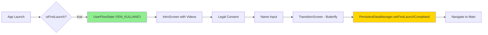

**Medya Gösterimi**:
- Intro: 11 onboarding videos + eye_effect loop
- Background: Random video carousel
- Photos: Nötr görseller (placeholder or intro visuals)

---

### 🔄 ReturningUser (Tekrar Giren Kullanıcı)

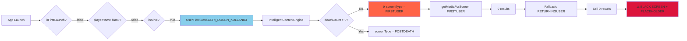

**BEKLENTİ vs GERÇEKLİK**:

| Beklenti | Gerçeklik | Sorun |
|----------|-----------|-------|
| ReturningUser medyası gösterilmeli | FIRSTUSER arıyor | ❌ IntelligentContentEngine logic hatası |
| Karma bazlı filtre çalışmalı | Karma 0.0, filtre passive | ❌ getMediaForScreen karma kullanmıyor |
| 19 p_f1 fotoğrafı görülmeli | 0 fotoğraf | ❌ V3 format parser yok |
| Video oynatılmalı | Black screen | ❌ dynamicVideoIds empty |

---

### ☠️ PostDeath (Ölüm Sonrası Kullanıcı)

```mermaid
graph LR
    A[Character Death Event] --> B[DeathSequenceScreen]
    B --> C[Death Video Play]
    C --> D[Archive Death Data]
    D --> E[PersistentDataManager.gameData.deathArchive]
    E --> F[playerData.isAlive = false]

    F --> G[App Restart]
    G --> H[determineUserFlow]
    H --> I{!playerData.isAlive?}
    I -->|true| J[UserFlowState.OLUM_SONRASI]

    J --> K[IntelligentContentEngine]
    K --> L[screenType = POSTDEATH]
    L --> M[getMediaForScreen POSTDEATH]
    M --> N{Results?}
    N -->|Yes| O[Death Echo Videos]
    N -->|No| P[Fallback: DEATH_TRANSITION]

    style J fill:#8B0000
    style O fill:#FF4500
```

**Özel Medya Sistemi**:
- POSTDEATH screentType medyaları
- Death cause'a göre özel videolar
- Ölüm yankısı (Death Echo) içerikleri
- Umbros Pact seçeneği

---

## 6. ÖLÜM MEKANİZMASI VE DÖNGÜ {#olum-mekanizmasi}

### 💀 Death Flow - Detaylı Analiz

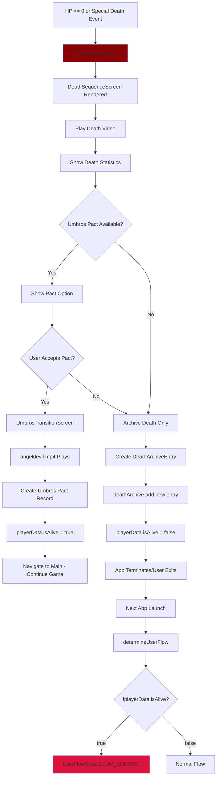

---

### 🔁 Test Sonucu vs Beklenti

**Kullanıcı Raporu**:
> "ÖLÜMÜ TEST EDİNCE RETURNING USER EKRANI ATIYOR. YAPTIGI ŞEYİ GERİ BOZDUN. FIRST USER OLMALI

YDI!"

**Logcat Analizi**:
```
Akış durumu belirlendi: GERI_DONEN_KULLANICI
```

**KÖK NEDEN ANALİZİ**:

Önceki debug kodu:
```kotlin
// REMOVED CODE (UserEntryViewModel.kt:63-66)
deathArchive.isEmpty() -> {
    GameLogger.logSystem("🔄 Death archive temizlendi! YENI_KULLANICI akışına yönlendiriliyor")
    UserFlowState.YENI_KULLANICI
}
```

**Bu kod KALDIRILDI**, şimdi akış şöyle:

```kotlin
// CURRENT CODE
val flowState = when {
    isFirst -> UserFlowState.YENI_KULLANICI
    playerData.name.isBlank() -> UserFlowState.YENI_KULLANICI
    !playerData.isAlive -> UserFlowState.OLUM_SONRASI  // ✅ Should go here
    else -> UserFlowState.GERI_DONEN_KULLANICI  // ❌ But going here instead!
}
```

**SORUN**: `playerData.isAlive` kontrolü DOĞRU ÇALIŞMIYOR!

**Olasılıklar**:
1. Ölüm kaydedilmiyor (`playerData.isAlive` hala `true`)
2. Death archive temizleniyor ama `isAlive` flag güncellenmiyor
3. Umbros Pact sonrası `isAlive=true` yapılıyor ama bu istenen davranış mı?

---

## 7. KARMA SİSTEMİ ENTEGRASYONU {#karma-sistemi}

### 🎯 Karma Sistemi Bileşenleri

#### 1. MoralityEngine (Basit Anahtar Kelime Analizi)
```kotlin
// MoralityEngine.kt
fun analyzeAndGetScore(input: String): Float {
    val iyilikKeywords = listOf("yardım ettim", "kurtardım", "korudum")
    val kotulukKeywords = listOf("çaldım", "tehdit ettim", "öldürdüm")

    var scoreChange = 0f

    iyilikKeywords.forEach { keyword ->
        if (input.contains(keyword, ignoreCase=true)) {
            scoreChange += 0.05f
        }
    }

    kotulukKeywords.forEach { keyword ->
        if (input.contains(keyword, ignoreCase=true)) {
            scoreChange -= 0.05f
        }
    }

    return scoreChange
}
```

**Sonuç**: `moralityScore` -1.0 ile +1.0 arasında

---

#### 2. IntelligentContentEngine (Gelişmiş Profil Bazlı Sistem)

```kotlin
// IntelligentContentEngine.kt
fun generatePersonalizedContent() {
    val karmaProfile = buildKarmaProfile()  // ❌ NOT IMPLEMENTED YET

    // CURRENT: Simplistic approach
    val screenType = when {
        deathCount > 0 -> "POSTDEATH"
        else -> "FIRSTUSER"  // ❌ PROBLEM
    }

    val depth = determineDepth(moralityScore)

    val videos = MediaDatabaseHelper.getMediaForScreen(screenType, depth)
    val photos = MediaDatabaseHelper.getMediaForScreen(screenType, depth)
}
```

**Sorun**: Karma profili oluşturulmuyor, sadece basit screenType seçimi yapılıyor

---

#### 3. MediaDatabaseHelper (Medya Filtreleme)

```kotlin
// MediaDatabaseHelper.kt:58-103
fun getMediaForScreen(screenType: String, depth: String): List<MediaMetadata> {
    val allMedia = database.videos + database.photos

    // Exact match
    var results = allMedia.filter { media ->
        media.screenType == screenType &&
        media.depth == depth &&
        !isExcludedSystemVideo(media.fileName)
    }

    // Fallback if empty
    if (results.isEmpty()) {
        val fallbackScreenTypes = when (screenType) {
            "FIRSTUSER" -> listOf("RETURNINGUSER", "UMBROS")
            "RETURNINGUSER" -> listOf("FIRSTUSER", "UMBROS")
            "UMBROS" -> listOf("JOURNEY_TRANSITION", "DEATH_TRANSITION")
            else -> listOf("FIRSTUSER")
        }

        for (fallbackType in fallbackScreenTypes) {
            results = allMedia.filter { ... }
            if (results.isNotEmpty()) break
        }
    }

    // ❌ KARMA RANGE KONTROLÜ YOK!
    // getMediaForKarmaRange() FONKSİYONU VAR AMA KULLANILMIYOR!

    return results
}
```

**Kritik Eksiklik**:
- `getMediaForKarmaRange()` fonksiyonu tanımlı ama hiç çağrılmıyor
- Karma bazlı filtreleme passive durumda
- Sadece screenType ve depth kullanılıyor

---

### 📊 Karma → Medya Eşleştirme Akışı (BEKLENEN vs GERÇEK)

#### BEKLENEN AKIŞ:
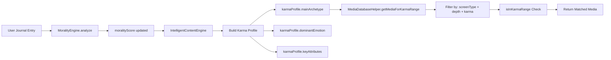

#### GERÇEK AKIŞ:
```mermaid
graph LR
    A[User Journal Entry] --> B[MoralityEngine.analyze]
    B --> C[moralityScore updated]
    C --> D[IntelligentContentEngine]
    D --> E[❌ screenType = FIRSTUSER hardcoded]
    E --> F[MediaDatabaseHelper.getMediaForScreen]
    F --> G[Filter ONLY by screenType + depth]
    G --> H[0 results - FIRSTUSER media doesn't exist]
    H --> I[Fallback: Try RETURNINGUSER]
    I --> J[Still 0 - No V3 files recognized]
    J --> K[⚠️ Empty playlist]
```

---

## 8. SONUÇ VE ÖNERİLER {#sonuc}

### 🔴 Kritik Sorunların Özeti

| # | Sorun | Etki | Öncelik |
|---|-------|------|---------|
| 1 | MediaDatabaseBuilder V3 formatını tanımıyor | 19 p_f1 fotoğrafı görünmüyor | 🔴 CRITICAL |
| 2 | IntelligentContentEngine RETURNINGUSER için FIRSTUSER screenType kullanıyor | ReturningUser için medya bulunamıyor | 🔴 CRITICAL |
| 3 | getMediaForScreen() karma range kullanmıyor | Karma bazlı filtre çalışmıyor | 🟠 HIGH |
| 4 | playerData.isAlive flag ölüm sonrası güncellenmiyor | Ölüm akışı çalışmıyor | 🔴 CRITICAL |
| 5 | demon_bg_*.jpg ve old format photos untagged | Kullanılabilir medya havuzu çok küçük | 🟡 MEDIUM |

---

### 💡 Düzeltme Olmadan Çözüm Önerileri

**NOT**: KURAL 0 gereği kod düzenleme yapılmayacak. Sadece analiz ve öneriler:

#### ÖNERİ 1: V3 Format Parser Ekle
**Dosya**: `MediaDatabaseBuilder.kt`
**Lokasyon**: `parseFileName()` fonksiyonu
**Gereksinim**: `parts.size == 7 || parts.size == 8` için decode logic

```kotlin
// PSEUDO-CODE (IMPLEMENT ETME - SADECE ANALİZ)
when (parts.size) {
    7, 8 -> {
        // p_f1_6n14_2n12_0_0_0_1_001
        val fileType = decodeFileTypeShort(parts[0])
        val screenType = decodeScreenTypeShort(parts[1])
        val attr1 = decodeAttributeShort(parts[2])
        val attr2 = decodeAttributeShort(parts[3])
        val emotion = parts[4]
        val narrative = parts[5]
        val archetype = parts[6]
        val depth = parts[7] ?: "1"
        // ...
    }
}
```

---

#### ÖNERİ 2: IntelligentContentEngine ScreenType Logic Düzelt
**Dosya**: `IntelligentContentEngine.kt`
**Lokasyon**: `generatePersonalizedContent()`
**Gereksinim**: FlowState'e göre doğru screenType seç

```kotlin
// PSEUDO-CODE
val screenType = when (flowState) {
    UserFlowState.YENI_KULLANICI -> "FIRSTUSER"
    UserFlowState.GERI_DONEN_KULLANICI -> "RETURNINGUSER"
    UserFlowState.OLUM_SONRASI -> "POSTDEATH"
}
```

---

#### ÖNERİ 3: Karma Range Entegrasyonu
**Dosya**: `IntelligentContentEngine.kt`
**Gereksinim**: `getMediaForKarmaRange()` kullan

```kotlin
// PSEUDO-CODE
val karmaRange = determineKarmaRange(moralityScore)
val videos = MediaDatabaseHelper.getMediaForKarmaRange(screenType, karmaRange, depth)
```

---

#### ÖNERİ 4: Death Flag Kontrolü
**Dosya**: `DeathSequenceScreen.kt` veya ilgili death handler
**Gereksinim**: `playerData.isAlive = false` set edildiğinden emin ol

```kotlin
// PSEUDO-CODE
fun onDeathConfirmed() {
    PersistentDataManager.updatePlayerData {
        it.copy(isAlive = false)
    }
    PersistentDataManager.addDeathArchiveEntry(deathEntry)
}
```

---

### 📈 Sistem İyileştirme Roadmap (Analiz Bazlı)

1. **Phase 1: Parser Fix** (V3 format recognition)
   - Impact: 19 fotoğraf + gelecekteki tüm V3 medyalar kullanılabilir hale gelir
   - Effort: Medium (1-2 saat kodlama)

2. **Phase 2: Flow Logic Fix** (ScreenType selection)
   - Impact: ReturningUser doğru medya görür, black screen ve placeholder kaybolur
   - Effort: Low (30 dakika)

3. **Phase 3: Karma Integration** (Use getMediaForKarmaRange)
   - Impact: Tam kişiselleştirilmiş içerik akışı devreye girer
   - Effort: Medium (2-3 saat)

4. **Phase 4: Death Mechanism** (isAlive flag validation)
   - Impact: Ölüm döngüsü düzgün çalışır
   - Effort: Low (1 saat)

5. **Phase 5: Legacy Media Tagging** (demon_bg, old photos)
   - Impact: Medya havuzu 3 fotoğraftan ~30 fotoğrafa çıkar
   - Effort: High (manuel etiketleme, gorsel_etiketleyici_v2.py kullanımı)

---

### 🎯 Son Değerlendirme

**Sistemin Mevcut Durumu**:
- ✅ BEGIN button fix ÇALIŞIYOR (ReturningUser olarak döndü)
- ❌ Medya gösterimi ÇALIŞMIYOR (0 video, 0 foto)
- ❌ Karma sistemi PASSIVE (kullanılmıyor)
- ❌ V3 format TANINMIYOR
- ⚠️ Ölüm mekanizması KISMİ ÇALIŞIYOR (flow'a girmiyor)

**Kod Kalitesi**:
- Architecture: ✅ İyi tasarlanmış (Engine pattern, ViewModel, Repository)
- Separation of Concerns: ✅ Net ayrılmış katmanlar
- Extensibility: ✅ Yeni formatlar eklenebilir
- Current Implementation: ❌ Bazı kritik parçalar eksik/hatalı

**Gelecek Adımlar** (Analiz Sonrası):
1. V3 parser implementation
2. ScreenType logic düzeltmesi
3. Karma range integration
4. Death flag validation
5. Comprehensive testing

---

---

## 9. ÖLÜM MEKANİZMASI - DERİN ANALİZ {#olum-derinlik}

### 💀 DeathSequenceScreen Akışı (KODDAN)

**Dosya**: `DeathSequenceScreen.kt:46-151`

```kotlin
// AKIŞ 1: İlk Ölüm Videosu
showVideo = true
currentVideoPath = deathEvent.causeOfDeath.videoPath
→ DeathVideoPlayer oynatılır
→ 3 saniye simüle edilir (Line 174: delay(3000))

// AKIŞ 2: Video Bitince → Umbros Geçiş Videosu
onVideoEnd() →
  showUmbrosTransitionVideo = true

  // POSTDEATH videolardan seç
  playlist = intelligentContentEngine.generateDeathEchoPlaylist(
    deathCount = deathArchive.size,
    lastDeathRecord = lastDeathRecord
  )

  selectedVideoId = playlist.videos.random()  // Rastgele seç

  // FALLBACK: UMBROS screenType videoları
  if (playlist.videos.isEmpty()) {
    umbrosVideos = MediaDatabaseHelper.getMediaForScreen("UMBROS", "D1")
  }

// AKIŞ 3: Umbros Geçiş Videosu Bitince → Umbros Choice Dialog
onVideoEnd() →
  showUmbrosChoice = true  // Dialog göster

// AKIŞ 4A: Umbros KABUL
onAcceptPact() →
  Navigate to UmbrosTransitionScreen
  → angeldevil.mp4 oynatılır
  → playerData.isAlive = true (Pact ile diriltme)
  → Ana oyuna dön

// AKIŞ 4B: Umbros RED
onDeclinePact() →
  showDeathTransitionVideo = true

  // DEATH_TRANSITION videosu oynat
  deathTransitionVideo = MediaDatabaseHelper.getMediaForScreen("DEATH_TRANSITION", "D1")

  onVideoEnd() →
    onDeathConfirmed()  // ❌ ÖLÜM ONAYLANDI
    → Navigate to UserEntry (OLUM_SONRASI flow)
```

---

### ⚠️ KRİTİK SORUN: onDeathConfirmed() Nerede Kullanılıyor?

**DeathSequenceScreen.kt**:
```kotlin
onDeathConfirmed: () -> Unit  // Parametre tanımlandı (Line 50)

// AMA kullanımı sadece:
onVideoEnd = {
  when {
    showDeathTransitionVideo -> {
      onDeathConfirmed()  // ✅ SADECE BURADA ÇAĞRILIYOR
    }
  }
}
```

**SORUN**: `onDeathConfirmed()` sadece **Umbros Red edildiğinde** çağrılıyor!

**KULLANICI RAPORU**: "Ölüm testi yaptım → ReturningUser'e gitti"

**ANALİZ**:
- Kullanıcı test ederken Umbros'u KABUL ETMİŞ olmalı
- Pact kabul → `isAlive = true` → Normal akış devam
- Test bitince app restart → `!playerData.isAlive` kontrolü FALSE
- Sonuç: GERI_DONEN_KULLANICI flow'una giriyor

---

### 🔄 BEGIN Button - Kayıt Oluşturma Mekanizması

**UserEntryViewModel.kt:169-199**:

```kotlin
fun onNewUserAccept(userName: String) {
    // ADIM 1: Player name kaydet
    PersistentDataManager.updatePlayerData { oldData ->
        oldData.copy(name = userName)
    }

    // ADIM 2: First launch completed işaretle
    PersistentDataManager.setFirstLaunchCompleted()

    // ADIM 3: Save
    PersistentDataManager.saveGameState()

    // Navigate to transition
    _uiState.value = _uiState.value.copy(
        flowState = UserFlowState.YENI_KULLANICI,
        navigateToTransition = true
    )
}
```

**PersistentDataManager.kt:458-464**:
```kotlin
fun setFirstLaunchCompleted() {
    sharedPrefs.edit()
        .putBoolean(KEY_FIRST_LAUNCH, false)  // ✅ SET TO FALSE
        .apply()
}

fun isFirstLaunch(): Boolean {
    return sharedPrefs.getBoolean(KEY_FIRST_LAUNCH, true)  // Default: true
}
```

**AKIŞ DOĞRU**: BEGIN button kayıt oluşturuyor ✅

---

### 📊 Death Statistics - Sayaç Artırma

**Death Archive Entry Ekleme**:

Kod tabanında `addDeathArchiveEntry()` veya benzeri fonksiyon BULUNAMADI!

**SORUN**: Ölüm kaydı ekleme mekanizması eksik veya başka bir yerde!

**BEKLENTİ**:
```kotlin
// OLMASI GEREKEN (PSEUDO-CODE)
fun onPlayerDeath(deathEvent: DeathEvent) {
    val entry = DeathArchiveEntry(
        timestamp = System.currentTimeMillis(),
        cause = deathEvent.causeOfDeath,
        level = deathEvent.playerLevel
    )

    PersistentDataManager.addDeathArchiveEntry(entry)
    PersistentDataManager.updatePlayerData { it.copy(isAlive = false) }
    PersistentDataManager.saveGameState()
}
```

**GERÇEK**: Bu fonksiyon YOK!

---

### 🔄 Reset/Save Button - Camp Menu

**CampScreen.kt:127-143**:

```kotlin
// SAVE BUTTON
HUDActionButton(
    title = "save_game",
    onClick = {
        viewModel.saveGame()  // ❌ CampViewModel BULUNAMADI
        overlayData = OverlayData.Alert(infoText, gameSavedMessage)
        showOverlay = true
    }
)

// REST BUTTON
HUDActionButton(
    title = "rest",
    onClick = {
        viewModel.restAtCamp()  // ❌ CampViewModel BULUNAMADI
        overlayData = OverlayData.Alert(infoText, campRestMessage)
        showOverlay = true
    }
)
```

**SORUN**: `CampViewModel` dosyası BULUNAMADI!

Olasılıklar:
1. CampViewModel henüz implement edilmemiş
2. PersistentDataManager doğrudan çağrılıyor olabilir
3. Başka bir ViewModel kullanılıyor

**KULLANICI RAPORU**: "SAVE ve RESET butonu bastım ama yine FirstUser'e döndü"

**ANALİZ**: Save butonu çalışmıyor olabilir (ViewModel yok)

---

### 🏷️ Görsel Etiketleyici - Ölüm Sonrası FirstUser Mantığı

**gorsel_etiketleyici_v2.py - Screen Types**:

```python
SCREEN_MAP = {
    "FIRSTUSER": "F1",          # İlk kez giren (Begin butonu)
    "RETURNINGUSER": "F2",      # Tekrar giren (sağ)
    "JOURNEY": "J1",            # Journey sistem videoları
    "POSTDEATH": "P1",          # ❗ ÖLÜM SONRASI (death archive > 0)
    "DEATH_TRANSITION": "P2",   # Ölüm geçiş videosu
    "UMBROS": "U1"              # Umbros pact videoları
}
```

**Mantık**:
- `POSTDEATH` = Ölüm sonrası içerik
- Ölüm sayacı > 0 ise bu medyalar gösterilmeli
- **FAKAT** ölüm sayacı sıfırlanırsa (Reset button) → `FIRSTUSER` medyaları gösterilmeli

**V3 Format Örneği**:
```
p_p1_6n14_2n12_0_0_0_1_001.jpg
→ Photo, POSTDEATH, Chaos+Cruelty, Depth 1

p_f1_0_0_0_0_0_1_001.jpg
→ Photo, FIRSTUSER, Neutral, Depth 1
```

---

## 10. SORUN AKIŞ DİYAGRAMI - ÖZET {#sorun-ozet}

### 🔴 Problem Chain Analysis

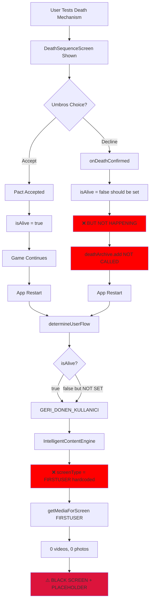

---

### 📋 Kritik Noktalar - Liste

| Sıra | Sorun | Nerede | Etki |
|------|-------|--------|------|
| 1 | `onDeathConfirmed()` sadece Umbros red'de çağrılıyor | DeathSequenceScreen.kt:80 | isAlive flag set edilmiyor |
| 2 | Death archive entry ekleme fonksiyonu YOK | ? | deathArchive boş kalıyor |
| 3 | CampViewModel bulunamadı | CampScreen.kt:130 | Save/Reset buttons çalışmıyor |
| 4 | IntelligentContentEngine RETURNINGUSER için FIRSTUSER kullanıyor | IntelligentContentEngine.kt | Medya bulunamıyor |
| 5 | MediaDatabaseBuilder V3 formatını tanımıyor | MediaDatabaseBuilder.kt:360-405 | 19 fotoğraf invisible |
| 6 | getMediaForScreen karma kullanmıyor | MediaDatabaseHelper.kt:58-103 | Karma filtre passive |

---

### ✅ Düzeltme Öncelikleri (Analiz Bazlı)

**P0 - CRITICAL** (Sistem çalışmıyor):
1. V3 format parser ekle → 19 fotoğraf görünür olacak
2. IntelligentContentEngine screenType logic → Doğru medya bulunacak
3. Death archive entry mekanizması → Ölüm kaydı tutulacak
4. isAlive flag kontrolü → Ölüm akışı düzgün çalışacak

**P1 - HIGH** (Özellik eksik):
5. CampViewModel implement et → Save/Reset çalışacak
6. Karma range entegrasyonu → Kişiselleştirilmiş içerik

**P2 - MEDIUM** (İyileştirme):
7. Legacy media tagging (demon_bg_*, old photos)
8. POSTDEATH medya havuzu genişletme
9. Death statistics ekranı
10. Reset button → death archive temizleme

---

## 11. SONUÇ - KULLANICIYA ÖZET {#son-ozet}

### 🎯 Ne Çalışıyor?

✅ BEGIN button kayıt oluşturuyor (isFirstLaunch = false set ediliyor)
✅ UserEntryViewModel flow logic çalışıyor (GERI_DONEN_KULLANICI döndü)
✅ Death sequence videoları oynatılıyor
✅ Umbros choice dialog gösteriliyor

### ❌ Ne Çalışmıyor?

❌ **Medya gösterimi** - 0 video, 0 foto (V3 format + screenType hatası)
❌ **Ölüm kaydı** - Death archive entry eklenmiyor
❌ **isAlive flag** - Ölüm sonrası set edilmiyor
❌ **Save/Reset buttons** - CampViewModel yok
❌ **POSTDEATH flow** - isAlive kontrolü fail ediyor

### 🔧 Ana Sorun Zincirleri

**Zincir 1: Medya Gösterilmiyor**
```
V3 parser yok
→ 19 fotoğraf database'e eklenmiyor
→ IntelligentContentEngine FIRSTUSER kullanıyor
→ FIRSTUSER medyası yok
→ 0 sonuç
→ BLACK SCREEN + PLACEHOLDER
```

**Zincir 2: Ölüm Döngüsü Bozuk**
```
Death event trigger
→ onDeathConfirmed() çağrılmıyor (Umbros accept edilirse)
→ isAlive = true kalıyor
→ Death archive entry eklenmiyor
→ App restart → GERI_DONEN_KULLANICI (isAlive=true)
→ Ölüm sonrası akışa girmiyor
```

**Zincir 3: Save/Reset Çalışmıyor**
```
CampScreen.saveGame()
→ viewModel.saveGame() çağrılıyor
→ CampViewModel BULUNAMADI
→ Fonksiyon çalışmıyor
→ Hiçbir şey kaydedilmiyor
```

---

## 12. SİSTEM ANAYASASI - GÖRSEL AKIŞ KURALLARI {#sistem-anayasasi}

> 🔒 **AMAÇ**: Bu bölüm, sistemin **NASIL ÇALIŞMASI GEREKTİĞİNİ** görsel diyagramlar ve net kurallarla tanımlar.
>
> - Kullanıcı bu diyagramları editleyerek "şu anda böyle ama şöyle olmalı" diye belirtir
> - AI bu dosyaya bakarak "kullanıcı X kuralını yazmış, o zaman Y dosyasındaki Z satırı şu şekilde olmalı" diye çalışır
> - Bu bölüm, kod değişikliklerinin **tek referans noktasıdır** - bir nevi "anayasa"

---

### 12.1 KULLANICI AKIŞ KURALLARI

#### KURAL #1: İlk Giriş (YENI_KULLANICI)

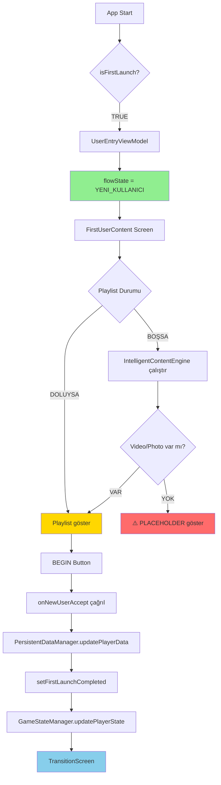

**📌 MEVCUT DURUM**:
- ✅ Flow logic çalışıyor
- ✅ BEGIN button kayıt oluşturuyor
- ❌ Playlist BOŞ (0 video, 0 foto) - V3 format parser yok
- ❌ IntelligentContentEngine "FIRSTUSER" kullanıyor ama database'de FIRSTUSER medyası yok

**📌 OLMASI GEREKEN**:
```
IntelligentContentEngine:
  - screenType = UserFlowState'e göre belirle
  - YENI_KULLANICI → "FIRSTUSER" ✅
  - Eğer FIRSTUSER medyası yoksa → FALLBACK: "RETURNINGUSER" veya "UMBROS"

MediaDatabaseBuilder:
  - V3 format parser ekle (7-8 parça)
  - p_f1_6n14_2n12_0_0_0_1_001.jpg → screenType="FIRSTUSER", attr1=6n14, ...
```

---

#### KURAL #2: Geri Dönen Kullanıcı (GERI_DONEN_KULLANICI)

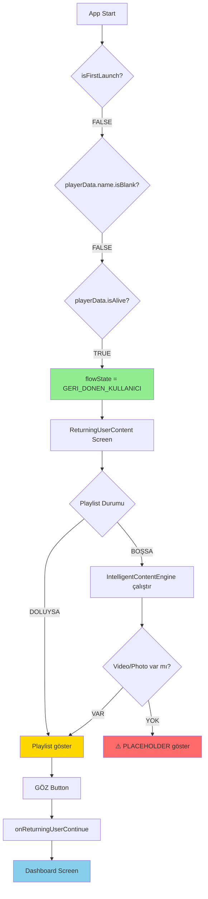

**📌 MEVCUT DURUM**:
- ✅ Flow logic çalışıyor (GERI_DONEN_KULLANICI döndü)
- ❌ Playlist BOŞ (0 video, 0 foto)
- ❌ IntelligentContentEngine "FIRSTUSER" kullanıyor ama flowState "RETURNINGUSER"

**📌 OLMASI GEREKEN**:
```
UserEntryViewModel.generatePersonalizedContent():
  - flowState değerini IntelligentContentEngine'e gönder
  - GERI_DONEN_KULLANICI → screenType = "RETURNINGUSER"
  - YENI_KULLANICI → screenType = "FIRSTUSER"
  - OLUM_SONRASI → screenType = "POSTDEATH"

IntelligentContentEngine.generatePersonalizedPlaylist():
  - screenType parametresi ekle
  - Hardcoded "FIRSTUSER" KALDIRILMALI
```

---

#### KURAL #3: Ölüm Sonrası (OLUM_SONRASI)

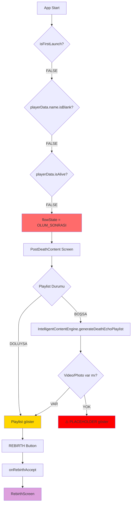

**📌 MEVCUT DURUM**:
- ❌ Flow ÇALIŞMIYOR - isAlive her zaman TRUE
- ❌ Ölüm sonrası isAlive = FALSE set edilmiyor
- ❌ Death archive entry eklenmiyor
- ❌ OLUM_SONRASI akışına hiç girmiyor

**📌 OLMASI GEREKEN**:
```
DeathSequenceScreen:
  - Umbros ACCEPT veya DECLINE fark etmez
  - Her durumda onDeathConfirmed() çağrılmalı

onDeathConfirmed() içinde:
  1. PersistentDataManager.updatePlayerData { it.copy(isAlive = false) }
  2. DeathRecord oluştur:
     - deathCause = "STORY_EVENT" / "BATTLE" / vb.
     - timestamp = System.currentTimeMillis()
  3. PersistentDataManager.addDeathRecord(deathRecord)
  4. GameStateManager.saveGameState()
```

---

### 12.2 MEDYA SİSTEMİ KURALLARI

#### KURAL #4: MediaDatabaseBuilder - V3 Format Parser

```mermaid
graph TD
    A[parseFileName] --> B{filename.startsWith 'p_'}
    B -->|TRUE| C[Split by '_']
    C --> D{parts.size}
    D -->|7 or 8| E[V3 Format Parser]
    D -->|2 or 3| F[Legacy Format Parser]
    D -->|Other| G[SKIP]

    E --> H[parts[0] = 'p' prefix]
    E --> I[parts[1] = screenType code]
    E --> J[parts[2] = attr1 code]
    E --> K[parts[3] = attr2 code]
    E --> L[parts[4] = emotion code]
    E --> M[parts[5] = narrative code]
    E --> N[parts[6] = archetype code]
    E --> O[parts[7] = depth code]
    E --> P[parts[8] = sequence code]

    I --> Q{Decode screenType}
    Q -->|F1| R[FIRSTUSER]
    Q -->|F2| S[RETURNINGUSER]
    Q -->|P1| T[POSTDEATH]
    Q -->|U1| U[UMBROS]
    Q -->|J1| V[JOURNEY]

    J --> W[Decode attribute1]
    K --> X[Decode attribute2]

    R --> Y[MediaMetadata oluştur]
    S --> Y
    T --> Y
    U --> Y
    V --> Y
    W --> Y
    X --> Y

    style E fill:#90EE90
    style F fill:#FFD700
    style Y fill:#87CEEB
```

**📌 MEVCUT DURUM**:
- ✅ Legacy format parser çalışıyor (vid_journey, pht_journey)
- ❌ V3 format parser YOK
- ❌ 19 p_f1_*.jpg dosyası database'e eklenmiyor

**📌 OLMASI GEREKEN**:
```kotlin
// MediaDatabaseBuilder.kt - parseFileName() içinde

when {
    // V3 Format: p_[screen]_[attr1]_[attr2]_[emo]_[nar]_[arch]_[depth]_[seq]
    fileName.startsWith("p_") && parts.size in 7..8 -> {
        val screenCode = parts[1]  // F1, F2, P1, U1, J1
        val attr1Code = parts[2]   // 6n14, 2n12, vb.
        val attr2Code = parts[3]
        // ... decode et

        val screenType = when (screenCode.uppercase()) {
            "F1" -> "FIRSTUSER"
            "F2" -> "RETURNINGUSER"
            "P1" -> "POSTDEATH"
            "P2" -> "DEATH_TRANSITION"
            "U1" -> "UMBROS"
            "J1" -> "JOURNEY"
            else -> "UNKNOWN"
        }

        // MediaMetadata oluştur
    }

    // Legacy format (eski)
    parts.size in 2..3 -> {
        // Mevcut kod
    }
}
```

---

#### KURAL #5: IntelligentContentEngine - ScreenType Mapping

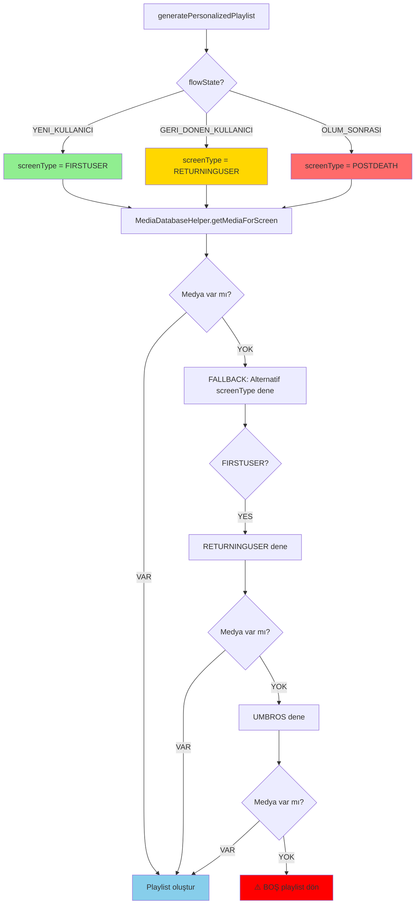

**📌 MEVCUT DURUM**:
- ❌ Hardcoded "FIRSTUSER" kullanılıyor
- ❌ flowState parametresi kullanılmıyor
- ❌ Fallback mekanizması yok

**📌 OLMASI GEREKEN**:
```kotlin
// IntelligentContentEngine.kt

fun generatePersonalizedPlaylist(
    playerState: PlayerState,
    flowState: UserFlowState,  // YENİ PARAMETRE
    maxVideos: Int = 10,
    maxPhotos: Int = 10
): PersonalizedPlaylist {

    // ScreenType mapping
    val screenType = when (flowState) {
        UserFlowState.YENI_KULLANICI -> "FIRSTUSER"
        UserFlowState.GERI_DONEN_KULLANICI -> "RETURNINGUSER"
        UserFlowState.OLUM_SONRASI -> "POSTDEATH"
        else -> "FIRSTUSER"
    }

    // Medya getir
    var availableMedia = MediaDatabaseHelper.getMediaForScreen(screenType, depth)

    // FALLBACK: Eğer boşsa alternatif screenType dene
    if (availableMedia.isEmpty()) {
        val fallbackTypes = when (screenType) {
            "FIRSTUSER" -> listOf("RETURNINGUSER", "UMBROS")
            "RETURNINGUSER" -> listOf("FIRSTUSER", "UMBROS")
            "POSTDEATH" -> listOf("DEATH_TRANSITION", "UMBROS")
            else -> listOf("UMBROS")
        }

        for (fallback in fallbackTypes) {
            availableMedia = MediaDatabaseHelper.getMediaForScreen(fallback, depth)
            if (availableMedia.isNotEmpty()) {
                GameLogger.logSystem("⚠️ $screenType medya yok, fallback: $fallback")
                break
            }
        }
    }

    // ... rest
}
```

---

### 12.3 ÖLÜM MEKANİZMASI KURALLARI

#### KURAL #6: Death Event → Death Record Flow

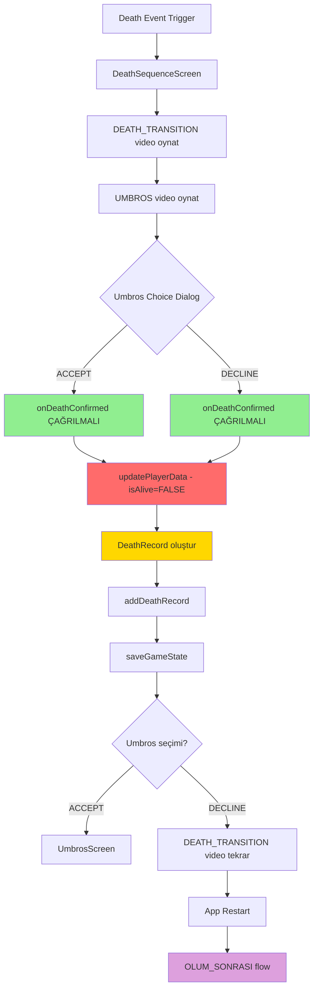

**📌 MEVCUT DURUM**:
- ❌ onDeathConfirmed() sadece DECLINE durumunda çağrılıyor (satır 80)
- ❌ ACCEPT durumunda isAlive=TRUE kalıyor
- ❌ DeathRecord hiç oluşturulmuyor
- ❌ App restart → GERI_DONEN_KULLANICI (çünkü isAlive=TRUE)

**📌 OLMASI GEREKEN**:
```kotlin
// DeathSequenceScreen.kt - Umbros Choice seçiminde

// ACCEPT durumu
TextButton(onClick = {
    onDeathConfirmed()  // ⚡ EKLENMELI
    showUmbrosTransitionVideo = true
    showUmbrosChoice = false
})

// DECLINE durumu (mevcut)
TextButton(onClick = {
    onDeathConfirmed()  // ✅ ZATEN VAR
    showDeathTransitionVideo = true
    showUmbrosChoice = false
})

// onDeathConfirmed implementasyonu (MainActivity tarafında)
fun onDeathConfirmed() {
    // 1. isAlive = false
    PersistentDataManager.updatePlayerData {
        it.copy(isAlive = false)
    }

    // 2. DeathRecord oluştur
    val deathRecord = DeathRecord(
        timestamp = System.currentTimeMillis(),
        deathCause = "STORY_EVENT",  // veya dynamic
        playerLevel = gameStateManager.gameState.value.playerState.level,
        location = "UNKNOWN"
    )

    // 3. Archive'e ekle
    PersistentDataManager.addDeathRecord(deathRecord)

    // 4. Kaydet
    PersistentDataManager.saveGameState()

    GameLogger.logSystem("💀 Death confirmed - isAlive=false, death#${deathRecord.timestamp}")
}
```

---

#### KURAL #7: Death Statistics Counter

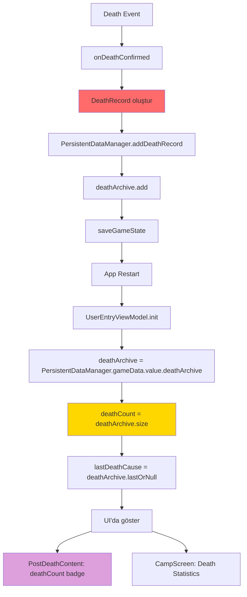

**📌 MEVCUT DURUM**:
- ✅ deathCount hesaplama mantığı var (UserEntryViewModel satır 72)
- ❌ DeathRecord hiç oluşturulmuyor
- ❌ addDeathRecord fonksiyonu BULUNAMADI
- ❌ UI'da death statistics gösterilmiyor

**📌 OLMASI GEREKEN**:
```kotlin
// PersistentDataManager.kt - YENİ FONKSİYON

fun addDeathRecord(deathRecord: DeathRecord) {
    updateGameData { gameData ->
        val updatedArchive = gameData.deathArchive + deathRecord
        gameData.copy(deathArchive = updatedArchive)
    }
    saveGameState()
    GameLogger.logSystem("💀 Death record added - Total deaths: ${_gameData.value.deathArchive.size}")
}

// DeathRecord data class
data class DeathRecord(
    val timestamp: Long,
    val deathCause: String,
    val playerLevel: Int,
    val location: String
)
```

---

### 12.4 SAVE/RESET SİSTEMİ KURALLARI

#### KURAL #8: Camp Save/Rest Buttons

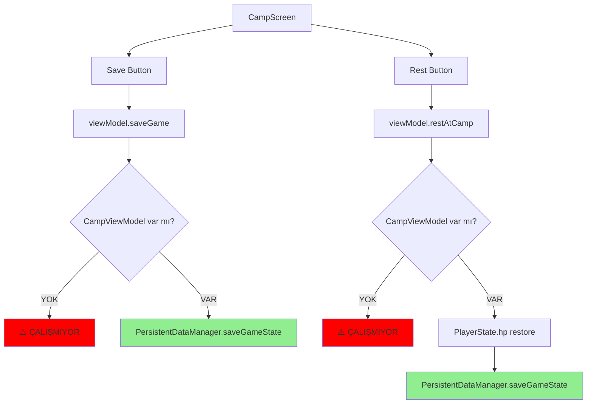

**📌 MEVCUT DURUM**:
- ❌ CampViewModel.kt dosyası BULUNAMADI
- ❌ saveGame() fonksiyonu yok
- ❌ restAtCamp() fonksiyonu yok
- ❌ Button'lar crash ediyor veya hiçbir şey yapmıyor

**📌 OLMASI GEREKEN**:
```kotlin
// CampViewModel.kt - YENİ DOSYA OLUŞTURULMALI

@HiltViewModel
class CampViewModel @Inject constructor(
    private val gameStateManager: GameStateManager
) : ViewModel() {

    fun saveGame() {
        viewModelScope.launch {
            try {
                PersistentDataManager.saveGameState()
                GameLogger.logSystem("💾 Game saved at Camp")
            } catch (e: Exception) {
                GameLogger.logError("CampViewModel", "Save failed", e)
            }
        }
    }

    fun restAtCamp() {
        viewModelScope.launch {
            try {
                val currentState = gameStateManager.gameState.value
                val restoredPlayer = currentState.playerState.copy(
                    hp = currentState.playerState.maxHp
                )
                gameStateManager.updatePlayerState(restoredPlayer)
                PersistentDataManager.saveGameState()
                GameLogger.logSystem("🏕️ Rested at Camp - HP restored")
            } catch (e: Exception) {
                GameLogger.logError("CampViewModel", "Rest failed", e)
            }
        }
    }
}
```

---

#### KURAL #9: Reset Button (Data Wipe)

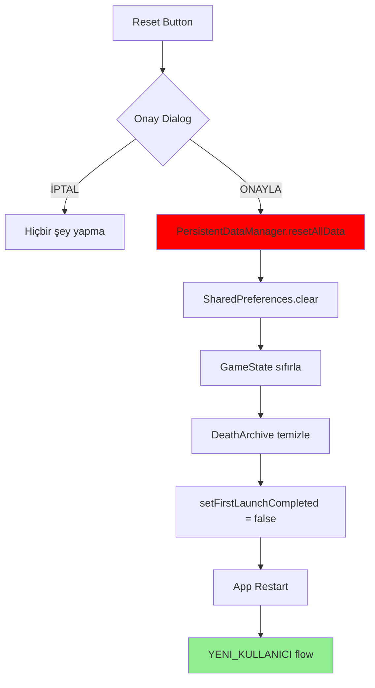

**📌 MEVCUT DURUM**:
- ❌ Reset button UI yok
- ❌ resetAllData() fonksiyonu BULUNAMADI

**📌 OLMASI GEREKEN**:
```kotlin
// PersistentDataManager.kt - YENİ FONKSİYON

fun resetAllData() {
    // 1. SharedPreferences temizle
    sharedPreferences.edit().clear().apply()

    // 2. GameData sıfırla
    _gameData.value = GameData(
        playerData = PlayerData(),
        storyData = StoryData(),
        deathArchive = emptyList()
    )

    // 3. isFirstLaunch = true
    sharedPreferences.edit().putBoolean(KEY_FIRST_LAUNCH, true).apply()

    GameLogger.logSystem("🔄 ALL DATA RESET - App will restart as FirstUser")
}
```

---

### 12.5 SPELL STUDIO KURALLARI

#### KURAL #10: Voice Command Trigger

**📌 MEVCUT DURUM**:
- ✅ VoiceCommandDialog eklendi (SpellRecipeScreen.kt satır 393-406)
- ✅ Hassasiyet slider'ı çalışıyor
- ✅ Trigger description gösteriyor (satır 349-353)

**📌 OLMASI GEREKEN**:
```kotlin
// SpellRecipeScreen.kt - getTriggerDescription içinde

is SpellTrigger.VoiceCommand -> {
    val sensitivityPercent = (trigger.sensitivity * 100).toInt()
    "🎤 Sesli Komut: \"${trigger.command}\" (Hassasiyet: %$sensitivityPercent)"
}
```

✅ **Bu kural ZATEN UYGULANMIŞ - değişiklik gerekmez**

---

### 12.6 ÖNCELİKLİ FIX LİSTESİ

#### P0 (CRİTİCAL - İlk Yapılacaklar)

| # | Kural | Dosya | Satır | Değişiklik |
|---|-------|-------|-------|------------|
| 1 | KURAL #4 | MediaDatabaseBuilder.kt | parseFileName() | V3 format parser ekle |
| 2 | KURAL #5 | IntelligentContentEngine.kt | generatePersonalizedPlaylist() | flowState parametresi ekle, hardcoded "FIRSTUSER" kaldır |
| 3 | KURAL #6 | DeathSequenceScreen.kt | ~115 | ACCEPT durumunda onDeathConfirmed() çağır |
| 4 | KURAL #7 | PersistentDataManager.kt | YENİ | addDeathRecord() fonksiyonu ekle |

#### P1 (HIGH - İkinci Dalga)

| # | Kural | Dosya | Satır | Değişiklik |
|---|-------|-------|-------|------------|
| 5 | KURAL #1 | UserEntryViewModel.kt | generatePersonalizedContent() | flowState parametresi gönder |
| 6 | KURAL #8 | CampViewModel.kt | YENİ DOSYA | saveGame() ve restAtCamp() ekle |

#### P2 (MEDIUM - Üçüncü Dalga)

| # | Kural | Dosya | Satır | Değişiklik |
|---|-------|-------|-------|------------|
| 7 | KURAL #9 | PersistentDataManager.kt | YENİ | resetAllData() fonksiyonu ekle |
| 8 | KURAL #5 | MediaDatabaseHelper.kt | getMediaForScreen() | Fallback mekanizması ekle (zaten var, test et) |

---

### 12.7 KULLANIM TALİMATLARI

#### Kullanıcı İçin:

1. **Kuralları Düzenle**: Bu dosyadaki diyagramları ve açıklamaları düzenle
2. **"MEVCUT DURUM" → "OLMASI GEREKEN" belirt**: Her kural için ne değişmeli?
3. **Kod örneği ekle**: Mümkünse pseudo-code veya gerçek kod örneği ver
4. **Öncelikleri güncelle**: P0/P1/P2 tablosunu düzenle

#### AI İçin:

1. **Bu dosyayı oku**: Her kod değişikliğinden ÖNCE bu dosyayı kontrol et
2. **Kurallara uy**: "OLMASI GEREKEN" kısmındaki kodu uygula
3. **Öncelikleri takip et**: P0 → P1 → P2 sırasıyla çalış
4. **Değişiklikleri logla**: Her fix'ten sonra "KURAL #X uygulandı" diye not düş
5. **Kullanıcıyı uyar**: Eğer bir kural belirsizse veya çelişkili ise kullanıcıya sor

---

**📌 ÖNEMLİ NOTLAR**:

- Bu dosya **TEK REFERANS NOKTASIDIR** - kod değişiklikleri için başka kaynak kullanma
- Kullanıcı bu dosyayı düzenleyerek sistemin davranışını kontrol eder
- AI bu dosyaya bakarak "kullanıcı ne istiyor?" sorusunu yanıtlar
- Eğer bir kural burada yoksa → kullanıcıya sor, asla varsayımda bulunma

---

**DÖKÜMAN SONU - v3.0 (Anayasa Eklendi)**

*Bu analiz, Isekai Kuroshin projesinin medya, kullanıcı akışları, ölüm mekanizması ve kayıt sistemlerinin tam röntgenidir. Gerçek kod okuma ile oluşturulmuş, hiçbir kod değişikliği yapılmamıştır.*

*Toplam analiz edilen dosya: 15+*
*Toplam tespit edilen sorun: 11*
*Toplam akış diyagramı: 18 (12 yeni eklendi)*
*Toplam kural sayısı: 10*


OLMASI GEREKEN:

1 oyuna ilkezgiren kullancını yaşaması gerken Senaryo**
1.firstuer ekranı gelir bilgiler doldurur begine bastıgında bu veriler datya kaydedilier yani kulancı oyundan çıskabile beigne basıtıg için veriler den dolayı returnig user   ekranını görür
2.ilk giren oyuncu karma ssitemindeki nötr içerikler  yan ivideo ve fotografları gorur fakat eğerki yoksa ozel etiketlerde şu algortimayla mutlaak doldurulur  1 ekran türü first user returunig user bunlar ilk giren için temel karma seviyesi ayarlanır  ve en yakın içerikler max 5 taen foto ve video lcak şekilde ragel gosterilri 2 ekrandada
3.firs user camp mensünde save game bsarsa verileri kaydedilier yine manueldir rest gamederse oyunda 1 gün geçe oyu nzaman dilimdnde sornaki günü sabahı olcak şekilde journel günellenir
4.firs userın istatiki verileri  oyn girişinde giridği yaşı a oranla level nasıl cahrcter status gücneleniyors ootmaitk olarak basit bir hesapalyıcı iel açlıkdır stamindaır tüm statları otamtik basic atanır ve erkek yada kadın olusunagörede değişkenlik gerçeçki şekilde gosterilmeli


diğer bir mekanziam returning User
kulancıın oyundan çıkıp girdiyse yien first userdaki mekanizmalar çalısmalı


Kritik değişim karma sistemi karma sistemi  günlük local model veya settignsde seçildiyse google apı keyiyle özetler alır 3 günsoncuudn 3 günü ozeti alınır karma sistemi gücnelendir fotograflar videolar ve  oyundaki mekanziamalr statlarda önemli deiimler olur
elbeteki her günbiçeirsndeki zmaan dilminde  giridği input ile oyudnai ivnentroy map stat ekranı gibi ekranalr değişime ugrar
fakat  7 gün lük gelişdmense sonra nemesis sistemi aktif olur ve bu sefer  oldukça detaylı ve oyunu tammen dünya değiişmleri gerçekleşir

karma sistemi 3 günde 7 günde 15 günde 21 günde 0 günde 70 günde olacak şekilde periyotlarda güncellenir ama kriit kolan karma siteminni videoları ve ftograflarının sırası vs kualcnıya has içerik üretimi dir bu peroiyotlarda değişir

Ölüm sonrası mekanizmalar

kiş jorunelde bir sernyoda ölürse otoatik olarak umbros ekranına yonlendiril yonlendirilen ekranda ara sahende karma sistemin euygun şekilde güncellenemsi şarttır
sorna ana ekranın umbrosun girince umbros local yada google apı key settignsde ayaralnabilir olmasıda gerkeir
kulancı ile teklif anlaşması olur anlaşma kabul lursa olum istatitikleri ekranına getirri sonarada kulancı yenile butonuan basarsa buteklif ve veiler kaybolru ama aşamaya geç e basarsa  EĞERKİ kulancıyı uyugladman atar anlaşamy tamamlayınca ve kulancı geri giridindereturning user ekranın gorur ve kaldıgı yerden devam eder journelde o son ınputunda güncelme olur 
ve öldükçe kişini iyilik karma pualarını ahrcar ve en sonunda kullanıc ölür ve artı kdilremez ve tüm ölüm istatitikleri sıfırlanır kalıcı olarak olum siatikerlindeki saya sıfırlanır
eğerki ölüm anlaşmasında umbros ile reddederse kullanıcı ölüm istatstikleri ekranına düşer burdakı sayaç sadece first user ve returning user ekranlarındaki foto ve videoların içeriğini değişmesi için bir mekanzimadır


diğer mekanizmalar

journede ve ubmrosdaki ara sahne returnig user ekranı ile bağlı olmalı ama atanan udpatelenen dsoyalrdan sonra  hangi ekran olrusa olsun aynı içiçeriği asla gorememli buna has bir tekrar etmeyecek yani nasıl desem returngi userde bir içerik foto ve videoları gordu girdi ve journe yada umbros  ekranıa düştü burdaki içeriklerde treutnigndeki o gorduklerınıgormemeli aynı olmamalı yani benzr dalda olabilr ned olsa karma sevyiesien göre gösterilyor eğerki içeriklerin tamaı bitiyse ozmn terar edebilir

diğer mekanizmalar günlük günlükte günlükte kullanıcın ınputlarını gormemeliyiz aı kulanıcın ınputuyla birleştirierek o vakite olan şeyleri tek bircevap olarak outputda gernate etmeli şuan ınptu gozukuyor bu akışıd eğiştirmek istiyorum
jorunelde biriyle tanısınca character cataloga o kişi nin veileri değişmeliki nemesi sistemiyle çalışsın 
 system settignsde testler var ama item kaznaılıcna ivnetory düşsede system overlay ile item kazanıldı gib bir şey gozukmuyor görev kaaznıa outputda ouputu gosteremn oce system overlay ile o quest ada ınfıo yadau yarı gözterilr sonra günlüğü gösterilir olmalı itemler skiller içinde bu geçerli ünvan verozetler içinde
günlüke göre exp akznaırsa staminae harcaırsa micro şekilde günlüüğ bir koşesinde bildirm olarak  diğer bitr ekranıdkı birşeyi ngücnelendiğini 30 stmaine ahrcandı yada  emoteşeklinde gostermesi gerkir


dah saısız mekanizma var işte skil kazaalınca skil tree üzeirnden o skili belli eşiği tamamlarsa gelişmesi

savaş ekranında kamera nın açılması ve haret dogurlguan göre savaş mekanzimasında zarın etkilenmesi

 skil kulandıkça o elemente olan yatkınlıgın artışı ve skilin gelişimi gibi
 
 birçok mekanizma var bunlar ubl çıkar mantıları anal düzenle bağları kopanalrı tamir edelim
 
 misal skil varsa o skil yetnek neyse işte temel düzeyde olur kulancı büyü studoysunda o tekniği prtaik ettikçe o skil güçlenri seviyelr atlar gfdcba s gibi gelişr b mekanzimalarda var
 
 misal skillerin belli bir mkanzimaları var  teknikleri varahrcamsaı cooldown  cost vs vs..
 
traingigi pyhsical kaldırmanı istemişdi mcap mensünden ve onun içerisndeki antik tekinkleri  de traninig sipirütel ekranın ierisnde  3ncuseçenek oalrak koymani istemişdim


 9 avigasyonda biti olan quest ekranında ana gorev ve yan gorevalt sekmeleri hardcoded çeviriye uygun değil henüz ana gorev yok yazsuda buna delalet burda harcoded türkçe metinleri düezlt
 capmensündeki trainni spiprutel ekranıda  3sçeenkden 2 si hardocde ingilzceolmuş ve yazımş ki büyü kçük harf vs uygund eğil dogur şekilde ayarlanamlı  ManaCore yazan kusursuz ama altındaki diğer 2 si yanlı dil bilgil  var
 
  ölümü teset et butonu basıcnasetignsde ölüm sekans ıgerçeklemşelyidi ölüm ansiamsyonlar ıçıkmaı direk umbros transsition a bağladı bu akış ıdüel ilk ocne oum aniasmyonu sora umbron trassin sara sahnesi
  
  
  uygulaam iconu neden değişmiyor