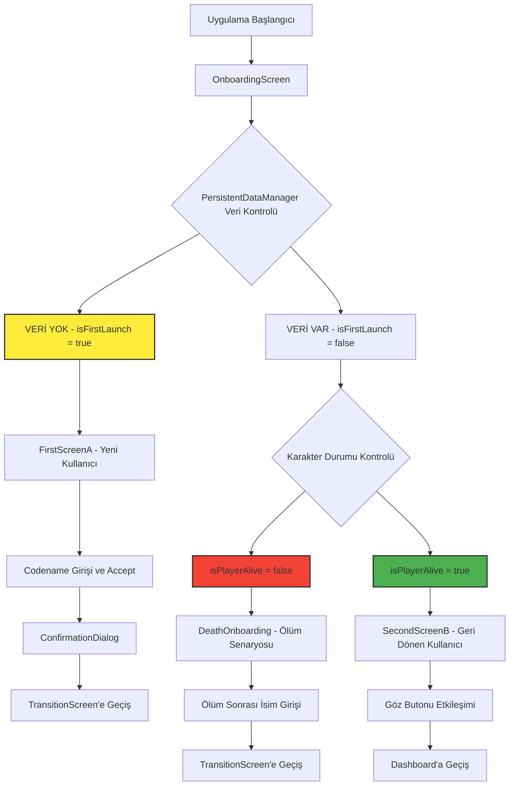

# IsekaiKuroshin - Sistem Mimarisi

## 🏗️ Genel Mimari

Proje, modern **MVI (Model-View-Intent)** prensiplerine dayanan, tek yönlü veri akışını benimseyen reaktif bir Android uygulama mimarisi kullanır. Mimarinin kalbinde, tüm oyun durumunu tek merkezden yöneten `GameStateManager` bulunur.

## 📐 Mimari Diyagramı

```mermaid
graph TD
    subgraph UI Katmanı
        A[UI Ekranları (Compose)]
    end

    subgraph ViewModel Katmanı
        B[ViewModels]
    end

    subgraph Merkezi Durum Yönetimi
        C[GameStateManager]
        D[GameStateZ7 (StateFlow)]
        E[Room Veritabanı]
    end

    subgraph Motor Katmanı
        F[Oyun Motorları (Engines)]
        G[AI Motoru (GlobalAIManager)]
    end

    A -- Kullanıcı Etkileşimi --> B
    B -- İş Mantığı Çağrısı --> F
    B -- AI Çağrısı --> G
    F -- Durum Güncelleme --> C
    G -- Durum Güncelleme --> C
    C -- Veriyi Kaydet/Yükle --> E
    C -- Merkezi Durumu Günceller --> D
    D -- Yeni Durumu Yayınlar --> B
    B -- UI Durumunu Hazırlar --> A

    style C fill:#FFD700,stroke:#333,stroke-width:4px
    style A fill:#00bfff,stroke:#333,stroke-width:2px
    style F fill:#98FB98,stroke:#333,stroke-width:2px
```

## 🔧 Ana Bileşenler

### 1. **Merkezi Durum Yönetimi**
- **`GameStateManager`:** Tek gerçek kaynak (Single Source of Truth) - tüm oyun durumunu yönetir
- **`GameStateZ7`:** Oyun verilerini içeren ana data class
- **`PersistentDataManager`:** Ayarlar ve kalıcı veri yönetimi
- **`AppDatabase` (Room):** SQLite veritabanı persistance

### 2. **UI Katmanı**
- **Ana Ekranlar:** Dashboard, Journal, Inventory, Map, Adventure, Settings
- **ViewModels:** Her ekran için özel ViewModel'ler
- **Jetpack Compose:** Deklaratif UI framework
- **Material 3:** Modern design system

### 3. **Motor (Engine) Katmanı**
- **`BasicStoryEngine`:** AI ile hikaye üretimi
- **`AdvancedDiceSystem`:** Zar ve şans mekanikleri
- **`TimeSystem`/`StaminaSystem`:** Zaman ve enerji yönetimi
- **`DeathManager`:** Ölüm ve yeniden doğum sistemleri
- **`BadgeEngine`/`SkillEngine`:** Başarım ve yetenek sistemleri

### 4. **AI Entegrasyonu**
- **`GlobalAIManager`:** MediaPipe LLM Inference API
- **Gemma 1.1-2B:** On-device AI model
- **Persistent Memory:** AI ile sürekli karakter etkileşimi

## 🔄 Veri Akışı

1. **Kullanıcı Etkileşimi** → UI'dan ViewModel'e intent gönderilir
2. **İş Mantığı** → ViewModel, Engine katmanındaki servisleri tetikler
3. **Durum Güncelleme** → Engine, GameStateManager üzerinden central state'i günceller
4. **Reaktif UI** → StateFlow ile UI otomatik olarak yeniden çizilir

## 🛡️ Mimari Avantajları

- **Test Edilebilirlik:** Her katman bağımsız olarak test edilebilir
- **Ölçeklenebilirlik:** Yeni özellikler kolayca eklenebilir
- **Bakım Kolaylığı:** Ayrıştırılmış sorumluluklar
- **Performans:** Reaktif state management ile optimize edilmiş render
- **Veri Güvenliği:** Merkezi state yönetimi ile tutarsızlık önlenir

## 📦 Proje Yapısı

```
app/src/main/java/com/example/isekaikuroshin/
├── ai/                    # AI management & conversation
├── data/                  # Data models & state management
├── engine/                # Game systems & automation
├── ui/                    # Screens & ViewModels
│   ├── dashboard/         # Main interface
│   ├── inventory/         # Equipment management
│   ├── journal/           # Story experience
│   ├── adventure/         # Adventure mode
│   ├── settings/          # Configuration
│   └── components/        # Reusable UI components
└── utils/                 # Helper utilities
```

## 🎯 Teknoloji Stack'i

- **Platform:** Android (Kotlin)
- **UI:** Jetpack Compose + Material 3
- **Architecture:** MVVM/MVI + StateFlow
- **DI:** Hilt
- **Database:** Room + SQLite
- **AI:** MediaPipe LLM (Gemma 1.1-2B)
- **Build:** Gradle KTS

---

*Bu mimari, oyunun karmaşık state'ini güvenli ve performanslı şekilde yönetmek için tasarlanmıştır.*

## BÖLÜM 4: MEVCUT BACKEND MİMARİSİ SON DURUM RAPORU (TODO-YS-02 SONRASI)

### 4.1. Genel Durum Özeti

TODO-YS-01 (ViewModel Entegrasyonu) ve TODO-YS-02 (Veri Modeli Birleştirme) görevlerinin başarıyla tamamlanmasının ardından, backend mimarimiz önemli ölçüde güçlenmiş ve tutarlı bir hal almıştır. **PlayerState**'in merkezi veri modeli olarak konumlandırılması ve **GameStateManager** etrafındaki mantık katmanlarının yeniden düzenlenmesi, sistemin daha sağlam ve sürdürülebilir bir temele oturmasını sağlamıştır.

En kritik başarı, veri modeli birleştirme işleminin build hatalarını tamamen ortadan kaldırması ve engine paketindeki sınıfların artık doğrudan GameStateManager ile etkileşim kurarak "Separation of Concerns" prensibine uygun şekilde çalışmasıdır. Sistem artık daha modüler, test edilebilir ve genişletilebilir bir yapıya sahiptir.

### 4.2. Çekirdek Veri Katmanı Analizi (`data` & `database`)

#### Ana Veri Modelleri:

* **PlayerState** (`data/PlayerState.kt`): Artık sistemin kalbi olan merkezi oyuncu durumu modeli. Temel nitelikler (strength, vitality, agility, intelligence), savaş istatistikleri (health, mana, attack, defense), ikincil istatistikler (stamina, hunger, fatigue, spirit, luck), ahlak sistemi (moralityScore, sinPoints) ve oyuncu profili (PlayerProfile) gibi tüm kritik verileri barındırır. @Serializable ile işaretlenmiş olması JSON dönüşümlerini kolaylaştırır.

* **Location** (`data/Location.kt`): Dinamik dünya sistemi için tasarlanmış konum modeli. Temel bilgiler (id, name, description), mekanik sınıflandırma (type, dangerLevel, requiredLevel), keşif sistemi (isDiscovered, knownResources) ve dinamik durumları (currentWeather, coordinates) içerir. WorldLocations objesi ile statik konumlar tanımlanır.

* **SkillTreeModels** (`data/SkillTreeModels.kt`): Yetenek ağacı sistemi için SkillNode ve SkillTreeUiState modelleri. Koordinat tabanlı UI pozisyonlama (x, y) ve parent-child ilişkileri ile hiyerarşik yapı destekler.

* **RegistryQuest** (`data/QuestModels.kt`): Görev sistemi için ContentRegistry ile entegre çalışan quest yapısı. ClassQuest ile arketip tabanlı sınıf görevlerini destekler.

#### Veritabanı Yapısı (`GameStateEntity`):

`GameStateEntity` (`database/GameStateEntity.kt`) artık `PlayerState` ve diğer birleşik modelleri doğrudan kullanacak şekilde refactor edilmiştir. Entity, `GameStateZ7`'nin tüm alanlarını mirror ederek Room veritabanında persistance sağlar. Önemli özellikler:
- Tek satır yaklaşımı (id = 1) ile current game state management
- Extension functions (toEntity(), toGameState()) ile seamless dönüşüm
- @TypeConverters annotation ile kompleks tiplerin otomatik handle edilmesi

#### Tip Dönüştürücüler (`Converters.kt`):

`TypeConverters.kt` (`database/TypeConverters.kt`) mimarideki kritik role sahiptir. PlayerState, List<RegistryQuest>, Map<String, NPCRelationship> gibi karmaşık Kotlin tiplerini JSON string'lere çevirerek Room'un bu kompleks veri yapılarını SQLite'da saklayabilmesini sağlar. Gson kullanarak güvenli serialization/deserialization işlemleri gerçekleştirir. Bu dosya olmaksızın modern veri modellerimiz Room ile çalışamazdı.

### 4.3. Durum Yönetim Katmanı Analizi (`GameStateManager`)

#### Sorumluluklar:

`GameStateManager` (`data/GameState.kt`) sistemin merkezi sinir sistemi olarak şu temel sorumluluklara sahiptir:

* **State Management**: MutableStateFlow ile reactive oyun durumu yönetimi ve StateFlow ile UI katmanına otomatik güncellemeler
* **Database Synchronization**: Her kritik değişiklikte otomatik veritabanı kaydetme ve uygulama başlangıcında state restore
* **Player Progression**: Experience kazanımı, level up mekanikleri, stat allocation ve derived stats recalculation
* **Resource Management**: Gold, resources ve inventory weight capacity hesaplamaları
* **Time System**: Zaman ilerletme, günlük/dönemsel değişiklikler ve action timestamping
* **Death Handling**: DeathManager ile entegre ölüm kontrolü ve game reset koordinasyonu
* **Profile Integration**: PlayerProfile güncellemeleri ve class quest trigger kontrolü

#### Etkileşimler:

* **ViewModel Katmanı**: ViewModels, GameStateManager'ın public methods'larını çağırarak state değişikliklerini tetikler
* **Engine Katmanı**: Engine sınıfları (UmbrosPactManager, DeathManager, AdvancedDiceSystem) GameStateManager referansı alarak state'i günceller
* **Database Katmanı**: GameStateDao aracılığıyla async olarak persistence operations gerçekleştirir
* **UI Katmanı**: StateFlow subscription ile reaktif UI güncellemeleri sağlar

### 4.4. Motor ve Mantık Katmanı Analizi (`engine`)

#### Refactor Edilen Yöneticiler:

**UmbrosPactManager** (`engine/UmbrosPactManager.kt`): Artık stateless bir yaklaşım benimser ve constructor'da GameStateManager referansı alır. Ölüm sonrası penalty sistemini (stat reduction, experience loss, curse duration) doğrudan GameStateManager üzerinden uygular. Bu refactor, manager'ın sadece business logic'e odaklanmasını ve state changes responsibility'nin doğru yerde olmasını sağlar.

**DeathManager** (`engine/DeathManager.kt`): GameStateManager injection ile death detection ve game reset koordinasyonunu handle eder. SharedFlow ile death events emit ederek UI katmanına notification gönderir. checkForDeath() method'u PlayerState.currentHealth kontrolü yaparak automatic death handling sağlar.

**AdvancedDiceSystem** (`engine/AdvancedDiceSystem.kt`): L1-L4 layer architecture ile sophisticated dice mechanics sunar. ContextAdapterL1 ile GameStateZ7'den DiceContext oluşturur, ResultProcessorL2 ile game effects hesaplar, StoryIntegrationL3 ile narrative text generate eder ve ActionSystemL4 ile GameStateManager'a integrate eder. Bu layered approach "Separation of Concerns" prensibinin mükemmel örneğidir.

#### Separation of Concerns Katkısı:

Engine sınıfları artık kendi domain logic'leri ile sınırlıdır ve state management responsibility'si tamamen GameStateManager'a devredilmiştir. Bu pattern şu avantajları sağlar:
- **Single Responsibility**: Her engine sadece kendi business logic'ine odaklanır
- **Testability**: Engine logic'i isolated olarak test edilebilir
- **Maintainability**: State değişiklikleri tek noktadan yönetilir
- **Reusability**: Engine'lar farklı context'lerde kullanılabilir

### 4.5. Ana Veri Akış Şeması

```
Kullanıcı Etkileşimi (UI - Compose)
         ↓
ViewModel Method Çağrısı
         ↓
Engine/Business Logic Execution
    (UmbrosPactManager, DeathManager, AdvancedDiceSystem etc.)
         ↓
GameStateManager Function Trigger
    (updatePlayerState, addExperience, modifyHealth etc.)
         ↓
Internal State Mutation (_gameState.update{})
         ↓
Automatic Database Persistence (saveGameStateToDatabase)
         ↓
StateFlow Emission (gameState: StateFlow<GameStateZ7>)
         ↓
ViewModel State Collection & UI State Preparation
         ↓
Reactive UI Recomposition (Jetpack Compose)
```

Bu flow'un kritik özelliği unidirectional data flow ve automatic persistence'tır. Her state değişikliği otomatik olarak database'e kaydedilir ve UI reaktif olarak güncellenir.

### 4.6. Tespit Edilen Riskler ve Mimari Öneriler

#### Potansiyel Riskler:

* **GameStateManager Complexity**: GameStateManager hala birçok sorumluluğa sahip. 428 satırlık dosya, ileride maintenance zorluklarına yol açabilir.

* **Single Point of Failure**: Tüm kritik operations GameStateManager üzerinden geçtiği için bu sınıftaki herhangi bir bug sistemi etkileyebilir.

* **Database Performance**: Her state değişikliğinde saveGameStateToDatabase() çağrısı frequent disk I/O'ya neden olabilir.

#### Mimari Öneriler:

* **Specialized Managers**: Gelecekte `InventoryManager`, `QuestManager`, `CombatManager` gibi domain-specific manager'lar oluşturularak GameStateManager'ın yükü azaltılabilir.

* **Caching Strategy**: Kritik olmayan güncellemeler için batch writing veya debounced saving implementasyonu düşünülebilir.

* **Error Handling**: GameStateManager'da comprehensive error handling ve recovery mechanisms eklenmelidir.

* **Event System**: State değişiklikleri için event-driven architecture düşünülerek loose coupling artırılabilir.

#### TODO-YS-03 İçin Öneriler:

Bu yeni mimari bize şu esneklikleri sağlar:

1. **Easy Feature Addition**: Yeni game mechanics kolayca engine katmanına eklenebilir ve GameStateManager ile integrate edilebilir
2. **Safe State Management**: Merkezi state management ile data inconsistency riskleri minimize edilmiştir
3. **Scalable Architecture**: Modular structure yeni requirements'lara kolay adaptasyon sağlar
4. **Robust Testing**: Her katman independent olarak test edilebilir duruma gelmiştir

# "Yaşayan Sistem" için Kullanılabilir Tüm Mekaniklerin Kapsamlı Listesi

## 1. Oyuncu Durum Mekanikleri (Player State Mechanics)
(Oyuncunun anlık durumunu ve temel özelliklerini tanımlayan mekanikler)

---
**Mekanik Adı:** Temel Nitelik Sistemi (Attributes)
**İlgili Kod Parçaları:** `PlayerState.strength`, `PlayerState.vitality`, `PlayerState.agility`, `PlayerState.intelligence`
**Açıklama:** Oyuncunun dört ana temel niteliğini temsil eder. Diğer birçok istatistik bu niteliklerden türetilir.
**GM için Potansiyel Kullanım Alanları:**
* Bir olayın sonucunu belirlemek için nitelik kontrolü gerektiren senaryolar oluşturmak (örn: "Kayayı kaldırmak için STR testi").
* NPC'lerin oyuncunun en yüksek niteliğine göre farklı diyaloglar sunması.
* Oyuncunun niteliklerine uygun özel görevler veya fırsatlar yaratmak.
---

**Mekanik Adı:** Sağlık ve Mana Sistemi
**İlgili Kod Parçaları:** `PlayerState.currentHealth`, `PlayerState.maxHealth`, `PlayerState.currentMana`, `PlayerState.maxMana`, `GameStateManager.modifyHealth()`, `GameStateManager.modifyMana()`
**Açıklama:** Oyuncunun hayatta kalma ve yetenek kullanma kaynaklarını yönetir.
**GM için Potansiyel Kullanım Alanları:**
* Oyuncunun canını veya manasını yenileyen/azaltan olaylar yaratmak (örn: "Zehirli bir tuzağa bastın", "Sakin bir gölde dinlenerek mana kazandın").
* Can veya mana seviyesine göre tetiklenen özel durumlar oluşturmak (örn: Can %20'nin altındayken "çaresizlik" bonusu).
---

**Mekanik Adı:** Savaş İstatistikleri Sistemi
**İlgili Kod Parçaları:** `PlayerState.physicalAttack`, `PlayerState.magicPower`, `PlayerState.defense`, `PlayerState.critChance`, `PlayerState.critDamage`
**Açıklama:** Oyuncunun savaş sırasında kullanacağı saldırı ve savunma yeteneklerini tanımlar.
**GM için Potansiyel Kullanım Alanları:**
* Farklı düşmanlara karşı farklı taktikler gerektiren senaryolar oluşturmak.
* Kritik vuruşlar veya özel yeteneklerin tetiklendiği olaylar yaratmak.
* Savunma seviyesine göre hasar azaltma mekanikleri ile oynamak.
---

**Mekanik Adı:** Dayanıklılık ve Hayatta Kalma Mekanikleri
**İlgili Kod Parçaları:** `PlayerState.stamina`, `PlayerState.hunger`, `PlayerState.fatigue`, `PlayerState.spirit`
**Açıklama:** Oyuncunun fiziksel ve zihinsel dayanıklılığını yöneten sistemler. Zamanla tükenir ve dinlenerek veya uygun eylemlerle yenilenir.
**GM için Potansiyel Kullanım Alanları:**
* Uzun seyahatler veya zorlu görevler sırasında yorgunluk mekanikleriyle oynamak.
* Açlık veya yorgunluk etkileriyle tetiklenen olaylar yaratmak.
* Manevi duruma göre farklı kararlar verilmesini teşvik etmek.
---

**Mekanik Adı:** Şans Mekaniği
**İlgili Kod Parçaları:** `PlayerState.luck`
**Açıklama:** Oyuncunun şans faktörünü temsil eder ve oyun mekaniklerinde rastgelelik etkilerini artırabilir.
**GM için Potansiyel Kullanım Alanları:**
* Şans tabanlı etkileşimlerde fark yaratmak.
* Şans puanına göre özel olaylar veya keşif şansları vermek.
---

**Mekanik Adı:** Ahlak ve Pasif Bonus Sistemi
**İlgili Kod Parçaları:** `PlayerState.moralityScore`, `PlayerState.sinPoints`, `PlayerState.passiveBonuses`, `GameStateManager.updateMoralityScore()`
**Açıklama:** Oyuncunun ahlaki durumunu ve pasif bonuslarını yönetir. -1.0 ile 1.0 aralığında değer alır.
**GM için Potansiyel Kullanım Alanları:**
* Aksiyonlara göre ahlak puanı değişimi ile dinamik etkileşimler yaratmak.
* Ahlak seviyesine göre farklı_NPC davranışları tetiklemek.
* Pasif bonuslar yoluyla uzun vadeli etkileşimler oluşturmak.
---

## 2. İlerleme ve Gelişim Mekanikleri (Progression & Development Mechanics)
(Oyuncunun zamanla nasıl güçlendiğini ve değiştiğini yöneten mekanikler)

---
**Mekanik Adı:** Seviye ve Tecrübe Sistemi
**İlgili Kod Parçaları:** `PlayerState.level`, `PlayerState.experience`, `PlayerState.experienceToNextLevel`, `GameStateManager.addExperience()`, `GameStateManager.levelUp()`
**Açıklama:** Oyuncunun eylemlerden tecrübe kazanmasını ve seviye atlamasını yönetir. Seviye atlama ile birlikte yetenek puanları kazanılır.
**GM için Potansiyel Kullanım Alanları:**
* Farklı miktarlarda tecrübe puanı veren dinamik görevler ve olaylar oluşturmak.
* Oyuncunun seviyesine göre ölçeklenen (scaling) düşmanlar veya zorluklar yaratmak.
---

**Mekanik Adı:** Yetenek Puanı Dağıtımı Sistemi
**İlgili Kod Parçaları:** `PlayerState.statPoints`, `GameStateManager.applyStatAllocations()`, `GameStateManager.recalculateDerivedStats()`
**Açıklama:** Oyuncunun seviye atladıkça kazandığı yetenek puanlarını niteliklere dağıtabilmesini sağlar.
**GM için Potansiyel Kullanım Alanları:**
* Oyuncunun yetenek tercihlerine göre özelleştirilmiş olaylar yaratmak.
* Belirli yetenek kombinasyonlarına özel_bonuslar veya zorluklar vermek.
---

**Mekanik Adı:** Nitelik Antrenman Sistemi
**İlgili Kod Parçaları:** `GameStateManager.getTrainingCost()`, `GameStateManager.trainStat()`, `GameStateManager.decrementStatPoints()`
**Açıklama:** Oyuncunun altın karşılığı niteliklerini doğrudan antrenman yaparak geliştirmesine olanak tanır.
**GM için Potansiyel Kullanım Alanları:**
* Oyuncunun zenginlik seviyesine göre gelişim fırsatları sunmak.
* Belirli konumlarda ya da NPC'lerle antrenman imkanları yaratmak.
---

## 3. Dünya ve Çevre Mekanikleri (World & Environment Mechanics)
(Oyuncunun içinde bulunduğu dünyanın özelliklerini ve durumunu tanımlayan mekanikler)

---
**Mekanik Adı:** Zaman ve Mevsim Sistemi
**İlgili Kod Parçaları:** `GameStateZ7.currentDay`, `GameStateZ7.currentTimeOfDay`, `GameStateZ7.currentSeason`, `TimeSystem.advanceTime()`, `TimeSystem.applyTimeOfDayEffects()`
**Açıklama:** Oyun dünyasındaki zamanın akışını ve anlık mevsim durumunu yönetir. 5 farklı zaman dilimi ve 4 mevsim içerir.
**GM için Potansiyel Kullanım Alanları:**
* Sadece belirli bir zamanda (örn: "sadece geceleyin") veya mevsimde ortaya çıkan olaylar/NPC'ler yaratmak.
* Zamanın geçmesinin (günlerin ilerlemesinin) sonuçlarını tetiklemek (örn: "Üç gün geçti ve yiyeceklerin bozuldu").
* Zaman geçişiyle tetiklenen stat etkileri yaratmak.
---

**Mekanik Adı:** Hava Durumu Sistemi
**İlgili Kod Parçaları:** `GameStateZ7.currentWeather`, `Location.currentWeather`
**Açıklama:** Oyun dünyasındaki anlık hava koşullarını yönetir ve konumlara göre farklılık gösterebilir.
**GM için Potansiyel Kullanım Alanları:**
* Sadece belirli hava durumunda etkin olaylar yaratmak (örn: "Sadece yağmurlu havada bulunabilecek nadir malzeme").
* Hava durumu etkileriyle savaş veya keşif mekaniklerini etkilemek.
---

**Mekanik Adı:** Konum Sistemi
**İlgili Kod Parçaları:** `Location`, `GameStateZ7.currentLocationId`, `GameStateZ7.knownLocations`, `WorldLocations`, `LocationDangerCalculator`
**Açıklama:** Oyun dünyasındaki farklı bölgeleri tanımlar ve her birinin türünü, tehlike seviyesini, gerekli seviyesini ve diğer özniteliklerini içerir.
**GM için Potansiyel Kullanım Alanları:**
* Oyuncunun seviyesine uygun konumlar önermek.
* Belirli konumlarda özel etkinlikler veya görevler yaratmak.
* Konumun tehlike seviyesine göre rastgele olaylar üretmek.
---

## 4. Sosyal ve İlişki Mekanikleri (Social & Relationship Mechanics)

---
**Mekanik Adı:** NPC İlişki Sistemi
**İlgili Kod Parçaları:** `GameStateZ7.npcRelationships`, `NPCRelationship`
**Açıklama:** Oyuncunun NPC'lerle olan ilişkisini ve etkileşim geçmişini takip eder.
**GM için Potansiyel Kullanım Alanları:**
* NPC'lerin oyuncuya karşı farklı davranışlar sergilemesi.
* İlişki seviyesine göre farklı görevler veya bilgiler sunmak.
---

## 5. Ekipman ve Envanter Mekanikleri (Equipment & Inventory Mechanics)

---
**Mekanik Adı:** Ekipman ve Envanter Sistemi
**İlgili Kod Parçaları:** `GameStateZ7.equippedItems`, `GameStateZ7.inventory`, `GameStateManager.calculateCurrentWeight()`, `GameStateManager.calculateMaxCarryCapacity()`, `GameStateManager.getWeightCapacityRatio()`
**Açıklama:** Oyuncunun ekipmanlarını, envanterini ve taşınabilir ağırlık sınırlarını yönetir.
**GM için Potansiyel Kullanım Alanları:**
* Aşırı yük taşımakla cezalandıran durumlar yaratmak.
* Belirli ekipmanlarla tetiklenen olaylar oluşturmak.
* Taşıma kapasitesine göre farklı stratejiler teşvik etmek.
---

## 6. Zar ve Rastgelelik Mekanikleri (Dice & Randomness Mechanics)

---
**Mekanik Adı:** Gelişmiş Zar Sistemi
**İlgili Kod Parçaları:** `AdvancedDiceSystem.kt`, `ContextAdapterL1`, `ResultProcessorL2`, `StoryIntegrationL3`, `ActionSystemL4`, `DiceEngine`
**Açıklama:** Oyun içi eylemlerin sonucunu belirlemek için gelişmiş zar atışı sistemi. Oyuncu durumu, konum, hava durumu gibi faktörleri dikkate alır.
**GM için Potansiyel Kullanım Alanları:**
* Farklı eylemler için özel başarı/mağlubiyet senaryoları oluşturmak.
* Ortam etkileriyle zar sonuçlarını etkilemek.
* Hikaye anlatımını zar sonuçlarına göre dinamikleştirmek.
---

## 7. Ekonomi ve Kaynak Mekanikleri (Economy & Resource Mechanics)

---
**Mekanik Adı:** Ekonomi ve Altın Sistemi
**İlgili Kod Parçaları:** `PlayerState.gold`, `GameStateManager.updateGold()`
**Açıklama:** Oyuncunun sahip olduğu altın miktarını ve ekonomik etkileşimleri yönetir.
**GM için Potansiyel Kullanım Alanları:**
* Fiyatlandırma mekanikleriyle oynamak.
* Oyuncunun zenginlik seviyesine göre farklı fırsatlar sunmak.
* Ticaret veya hırsızlık gibi mekanikler yaratmak.
---

## 8. Ölüm ve Lanet Mekanikleri (Death & Curse Mechanics)

---
**Mekanik Adı:** Ölüm ve Lanet Sistemi
**İlgili Kod Parçaları:** `DeathManager`, `UmbrosPactManager`, `UmbrosContract`, `DeathCause`, `DeathEvent`
**Açıklama:** Oyuncunun ölüm durumunu algılar ve Umbros Paktı sayesinde cezalarla devam etme imkanı sunar.
**GM için Potansiyel Kullanım Alanları:**
* Ölüm sonuçlarını dramatik hikaye anlatımıyla kullanmak.
* Lanet mekanikleriyle uzun vadeli cezalar yaratmak.
* Oyuncunun risk alma davranışlarını şekillendirecek senaryolar kurmak.
---

## 9. Zaman ve Zorluk Mekanikleri (Time & Difficulty Mechanics)

---
**Mekanik Adı:** Zorluk ve Zaman Yönetimi
**İlgili Kod Parçaları:** `GameStateZ7.lastActionTime`, `GameStateManager.advanceTime()`, `TimeSystem.advanceTime()`, `StaminaSystem.performAction()`, `StaminaSystem.rest()`, `StaminaSystem.increaseHunger()`
**Açıklama:** Oyun içi zamanı ilerletir ve oyuncunun fiziksel durumunu zamanla etkiler.
**GM için Potansiyel Kullanım Alanları:**
* Zaman baskısı yaratan görevler tasarlamak.
* Fiziksel durumun etkilerini oyun mekaniği olarak kullanmak.
* Dinlenme ve planlama zamanlarının önemini vurgulamak.
---

## 10. Profil ve Arketip Mekanikleri (Profile & Archetype Mechanics)

---
**Mekanik Adı:** Oyuncu Profili ve Arketip Sistemi
**İlgili Kod Parçaları:** `PlayerState.playerProfile`, `PlayerProfile`, `GameStateManager.updatePlayerProfile()`, `GameStateManager.checkForClassQuestTriggers()`
**Açıklama:** Oyuncunun karakter arketip puanlarını ve genel profilini yönetir. Belirli arketip puanlarına ulaşınca özel görevler tetikler.
**GM için Potansiyel Kullanım Alanları:**
* Arketip puanlarına göre özelleştirilmiş hikayeler oluşturmak.
* Belirli arketiplere uygun olaylar ve kararlar sunmak.
* Oyuncunun karakter gelişimini şekillendiren uzun vadeli sistemler kurmak.
---

## 11. Görev ve Hikaye Mekanikleri (Quest & Story Mechanics)

---
**Mekanik Adı:** Görev ve Hikaye Sistemi
**İlgili Kod Parçaları:** `GameStateZ7.activeQuests`, `GameStateZ7.completedQuests`, `GameStateZ7.storyPages`, `GameStateZ7.currentPage`, `GameStateManager.addStoryPage()`, `GameStateManager.updateLastStoryPage()`, `QuestModels`
**Açıklama:** Aktif ve tamamlanmış görevleri takip eder, hikaye sayfalarını oluşturur ve oyun ilerleyişini belgeler.
**GM için Potansiyel Kullanım Alanları:**
* Dinamik görev sistemleri oluşturmak.
* Hikaye ilerleyişine göre farklı olaylar tetiklemek.
* Görev tabanlı kararlarla farklı hikaye dalları yaratmak.
---

## 12. Yetenek ve Rozet Mekanikleri (Skill & Badge Mechanics)

---
**Mekanik Adı:** Yetenek ve Rozet Sistemi
**İlgili Kod Parçaları:** `GameStateZ7.activeSkills`, `GameStateZ7.activeBadges`, `SkillTreeModels`, `SkillNode`, `GameStateManager.applyStatAllocations()`
**Açıklama:** Oyuncunun sahip olduğu yetenekleri ve kazandığı rozetleri takip eder.
**GM için Potansiyel Kullanım Alanları:**
* Yeteneklere göre özel etkileşimler yaratmak.
* Rozetlerle ödüllendirme mekanikleri kurmak.
* Yetenek sistemleriyle stratejik kararlar teşvik etmek.
---

Önemli Mimari Not ve Gelecek İçin Prensip Kararı
Coder'ın ObserverEngine içine eklediği calculateCurrentWeight ve calculateMaxCarryCapacity gibi private yardımcı fonksiyonları fark ettim. Bu, kodun o an çalışmasını sağlasa da, üzerinde durmamız gereken önemli bir mimari prensibi ihlal ediyor:

Sorun: Bu iki fonksiyonun mantığı, zaten GameStateManager içinde mevcuttu. Bu mantığı ObserverEngine içinde yeniden yazmak, kod tekrarına ve "Tek Doğruluk Kaynağı" (Single Source of Truth) ilkesinin zedelenmesine neden olur. Yarın, taşıma kapasitesi formülünü değiştirmek istediğimizde, bunu iki farklı yerde değiştirmek zorunda kalırız ki bu, gelecekteki hataların en büyük nedenidir.

Prensip Kararı: Gözlemci motorları (Observer Engines) ASLA kendi iş mantığını veya hesaplamasını içermemelidir. Onların tek görevi, GameStateManager gibi merkezi yöneticilerden hazır ve hesaplanmış verileri alıp, istenen formatta raporlamaktır. ObserverEngine ağırlığı hesaplamamalı, GameStateManager'a "Mevcut ağırlık nedir?" diye sormalıdır.

Bu bir hata değil, önemli bir öğrenimdir. Şu anki kod çalışır durumda olduğu için bunu düzeltmek için yeni bir görev oluşturmayacağız. Ancak bu prensibi, Faz 3'te yazacağımız tüm yeni kodlar için bir altın kural olarak kabul etmeliyiz

## BÖLÜM 5: GİRİŞ VE ONBOARDING AKIŞI

### 5.1. Giriş Sistemi Mimarisi

Isekai Kuroshin uygulamasının giriş akışı, kullanıcının durum verilerine göre dinamik olarak üç farklı senaryo sunacak şekilde tasarlanmıştır. Bu sistem, oyuncunun ilk kez mi geldiğini, karakterinin ölü mü yoksa yaşıyor mu olduğunu kontrol ederek uygun giriş deneyimini sağlar.

### 5.2. Onboarding Akışı Diyagramı



### 5.3. Ekran Bazlı Detaylı Analiz

#### 5.3.1. FirstScreenA (Yeni Kullanıcı)

**Tetiklenme Koşulu:** `isFirstLaunch = true`
**Amaç:** İlk kez uygulamayı açan kullanıcıları karşılamak
**Temel Özellikler:**
- **Arka Plan Katmanı:** BackgroundSlideshow (6 nötr/karma-dengeleli fotoğraf, 3sn aralıklarla)
- **Video Katmanı:** Rastgele video oynatıcısı (180x120dp, rastgele offset)
- **UI Katmanı:** Codename input alanı ve Accept butonu
- **Video İçerik:** Nötr başlangıç videoları (video3p2neutral, video7p3neutral, video1p5happy, video9p1happy, video2m3sad, video6m1sad)

**Karma/Morality Etkisi:** İlk kullanımda karma puanı olmadığı için karma-dengeli içerik gösterilir

#### 5.3.2. SecondScreenB (Geri Dönen Kullanıcı)

**Tetiklenme Koşulu:** `isFirstLaunch = false && isPlayerAlive = true`
**Amaç:** Var olan karakteri ile geri dönen kullanıcıları karşılamak
**Temel Özellikler:**
- **Arka Plan Katmanı:** ReturningUserBackgroundSlideshow (morality-score'a göre dinamik)
- **Video Katmanı:** Tam ekran video oynatıcısı (morality-based selection)
- **UI Katmanı:** Göz butonu (EyeButtonB3) ile dashboard geçişi

**Karma/Morality Etkisi:**
- **Kötülük (< -0.3):** Üzgün, öfkeli, korku temelli videolar ve fotoğraflar
- **İyilik (> 0.3):** Mutlu, pozitif temelli videolar ve fotoğraflar
- **Nötr (-0.3 to 0.3):** Karma-dengeli içerik

#### 5.3.3. DeathOnboarding (Ölüm Senaryosu)

**Tetiklenme Koşulu:** `isFirstLaunch = false && isPlayerAlive = false`
**Amaç:** Ölen karakterle geri dönen kullanıcıları Umbros sistemi ile karşılamak
**Temel Özellikler:** [Implementation detayları henüz eksik]

### 5.4. Akıllı İçerik Sistemi

Onboarding sürecinde kullanılan fotoğraf ve video içerikleri, oyuncunun karma durumuna göre dinamik olarak seçilir:

#### 5.4.1. Video İçerik Katalogu

**Mutluluk/İyilik Videoları:**
- video1p5happy, video5p8happy, video9p1happy, video11p9happy

**Üzüntü/Kötülük Videoları:**
- video2m3sad, video4m5angry, video6m1sad, video8m7fear, video10m2sad

**Nötr Videolar:**
- video3p2neutral, video7p3neutral

#### 5.4.2. Fotoğraf İçerik Katalogu

**Mutluluk/İyilik Fotoğrafları:**
- photo1p3happy, photo5p7happy

**Üzüntü/Kötülük Fotoğrafları:**
- photo2m2sad, photo4m4angry, photo6m8sad, photo8m9fear

**Nötr Fotoğraflar:**
- photo3p1neutral, photo7p2neutral

### 5.5. Tespit Edilen Sorunlar

#### 5.5.1. Görsel Katmanlama (Z-index) Problemi

**Sorunun Tanımı:** FirstScreenA ve SecondScreenB ekranlarında, BackgroundSlideshow (arka plan fotoğrafları) video katmanının altında kalarak görünmez halde. Bu durum, Jetpack Compose'daki Box hiyerarşisinin yanlış kurgulanmasından kaynaklanmaktadır.

**Etkilenen Alanlar:**
- FirstScreenA: BackgroundSlideshow, BackgroundVideoPlayer'ın arkasında kalıyor
- SecondScreenB: ReturningUserBackgroundSlideshow, AndroidView video player'ın arkasında kalıyor

**Teknik Sebep:** Box Composable'ı içinde, önce tanımlanan component arkada, sonra tanımlanan component önde render ediliyor. Mevcut kodda video komponenti fotoğraf slideshow'undan sonra tanımlandığı için önde kalıyor.

**Beklenen Davranış:** Arka plan fotoğrafları en arkada, video ortada, UI elementleri en önde olmalı.

### 5.6. Debug ve Loglama Sistemi

Onboarding akışının her kritik noktasında GameLogger.logOnboarding() kullanılarak detaylı izleme sağlanır:

**Loglanan Olaylar:**
- OnboardingScreen başlangıcında kullanıcı durumu ve morality score
- Video listesi seçimi ve karma kategorisi
- Arka plan fotoğraf listesi seçimi
- Kullanıcı etkileşimleri (Accept butonu, Göz butonu)
- Composable başlangıçları (BackgroundSlideshow, VideoPlayer)

**Log Formatı:** `[TIMESTAMP] [ONBOARDING] [Emoji] Açıklayıcı mesaj - Teknik detaylar`

### 5.7. Mimari Kararlar ve Prensipleri

**Reaktif State Management:** PersistentDataManager.gameData StateFlow'u kullanılarak reactive UI güncellemeleri
**Kompozisyon Tabanlı:** Her ekran kendi Composable'ı olarak ayrıştırılmış
**Karma-Driven Content:** Oyuncu davranışları sonucu değişen içerik deneyimi
**Defensive Logging:** Gelecekteki debug süreçleri için kapsamlı izleme

Bu onboarding sistemi, oyuncunun geçmiş davranışlarına göre kişiselleştirilmiş bir giriş deneyimi sunarken, sistem kararlılığı ve debug edilebilirlik açısından sağlam temeller oluşturur.