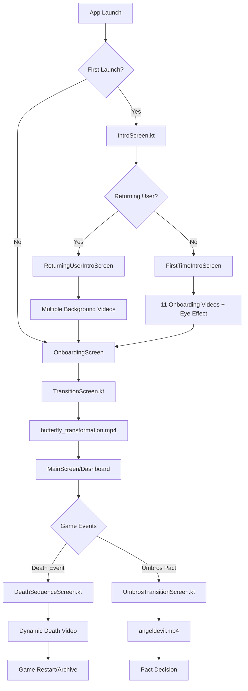

# 🎬 Isekai Kuroshin Video System Analysis

## 📋 Sistem Genel Bakış

Isekai Kuroshin oyunu, kullanıcı deneyimini zenginleştirmek için stratejik noktalarda çeşitli video entegrasyonları kullanmaktadır. Bu sistem, oyun akışının farklı aşamalarında dinamik video gösterimleri sağlamaktadır.

---

## 🎯 Video Ekranları ve Tetiklenme Koşulları

### 1. **IntroScreen.kt** 📍
**Dosya:** `ui/intro/IntroScreen.kt`

#### **Tetiklenme Koşulu:**
- **İlk Kez Başlatma:** `PersistentDataManager.isFirstLaunch() == true`
- Ana navigasyon startDestination: `"intro"`

#### **Kullanıcı Durumuna Göre Dallanma:**
```kotlin
val isReturningUser = gameData.playerData.name.isNotEmpty() && gameData.playerData.isAlive

if (isReturningUser) {
    ReturningUserIntroScreen(onIntroComplete)
} else {
    FirstTimeIntroScreen(onIntroComplete)
}
```

#### **Video Katmanları:**
1. **Arkaplan Rastgele Videoları (11 adet):**
   - `onboarding_video_1.mp4` → `onboarding_video_11.mp4`
   - Rastgele seçim ve döngüsel oynatma

2. **Ana Video Katmanı:**
   - Kullanıcı kontrollü (play/pause/mute/next)
   - Fotoğrafların üstünde oynar

3. **Ortadaki Göz Videosu:**
   - `eye_effect.mp4` - Sürekli döngü
   - Küçük boyut, tıklanabilir

#### **Kontrol Butonları:**
- 🔊/🔇 Ses açma/kapama
- ▶️/⏸️ Oynat/duraklat
- ⏭️ Rastgele video geçiş

---

### 2. **TransitionScreen.kt** 🦋
**Dosya:** `ui/transition/TransitionScreen.kt`

#### **Tetiklenme Koşulu:**
- Onboarding tamamlandıktan sonra
- Navigation route: `"transition/{userName}"`

#### **Video Özellikleri:**
- **Ana Video:** `butterfly_transformation.mp4`
- Otomatik başlar ve tek sefer oynar
- Video bitince son frame'de durur
- Hand-eye emoji gösterir

#### **Video Kontrol Davranışı:**
```kotlin
override fun onPlaybackStateChanged(playbackState: Int) {
    if (playbackState == Player.STATE_ENDED) {
        transitionPlayer.seekTo(transitionPlayer.duration - 1) // Son frame'de kal
        transitionPlayer.pause()
        showHandEyeEmoji = true
    }
}
```

---

### 3. **UmbrosTransitionScreen.kt** 😈
**Dosya:** `ui/dashboard/UmbrosTransitionScreen.kt`

#### **Tetiklenme Koşulu:**
- Umbros pact eventi sırasında
- Navigation route: `"umbros_transition"`

#### **Video Özellikleri:**
- **Ana Video:** `angeldevil.mp4`
- Sessize alınmış (`volume = 0f`)
- Tıklanabilir skip özelliği
- Video bitince otomatik devam

#### **Skip Özelliği:**
```kotlin
videoComplete = true // Video'yu atla
```

---

### 4. **DeathSequenceScreen.kt** 💀
**Dosya:** `ui/screens/DeathSequenceScreen.kt`

#### **Tetiklenme Koşulu:**
- Oyuncu ölümü gerçekleştiğinde
- `DeathEvent` tetiklendiğinde

#### **Video Özellikleri:**
- **Dinamik Video Path:** `deathEvent.causeOfDeath.videoPath`
- Ölüm nedenine göre farklı videolar
- 3 saniye simülasyon süresi
- Umbros pact seçeneği

#### **Video Sistemi:**
```kotlin
videoPath = deathEvent.causeOfDeath.videoPath
LaunchedEffect(videoPath) {
    delay(3000) // 3 saniye video simülasyonu
    onVideoComplete()
}
```

---

## 📂 Video Dosya Envanteri

### **🎬 Intro/Onboarding Videoları (11 adet):**
- `onboarding_video_1.mp4` → `onboarding_video_11.mp4`

### **🔄 Geçiş Videoları:**
- `butterfly_transformation.mp4` - Ana geçiş animasyonu
- `angeldevil.mp4` - Umbros pact videosu
- `death_transition_video.mp4` - Ölüm geçiş animasyonu

### **👁️ Efekt Videoları:**
- `eye_effect.mp4` - Göz efekti (döngüsel)
- `intro_animation.mp4` - Giriş animasyonu

### **📖 Kitap Animasyonları:**
- `book_opening.mp4` - Kitap açılma
- `book_closing.mp4` - Kitap kapanma
- `book_waiting.mp4` - Kitap bekleme
- `page_turn.mp4` - Sayfa çevirme
- `page_turn_forward.mp4` - İleri sayfa çevirme
- `page_turn_backward.mp4` - Geri sayfa çevirme
- `reverse_page_turning.mp4` - Ters sayfa çevirme

### **🌸 Dekoratif Animasyonlar:**
- `lotus_blossom_animation.mp4` - Lotus çiçeği animasyonu

---

## 🎮 Navigation Akış Diyagramı



---

## ⚙️ Teknik Implementasyon

### **ExoPlayer Kullanımı:**
- **androidx.media3.exoplayer.ExoPlayer**
- **androidx.media3.ui.PlayerView**
- **androidx.media3.common.MediaItem**

### **Video Kontrol Özellikleri:**
- Otomatik oynatma/duraklat
- Ses kontrolü (mute/unmute)
- Loop/repeat modları
- Seek pozisyonları
- Rastgele video seçimi

### **State Management:**
- `remember { mutableStateOf() }` ile state yönetimi
- `LaunchedEffect` ile video lifecycle
- `DisposableEffect` ile cleanup

---

## 🎯 Video Tetikleme Stratejileri

### **1. Uygulama Başlatma:**
- İlk açılış → Full intro experience
- Tekrar açılış → Returning user flow

### **2. Oyun Akışı:**
- Onboarding tamamlama → Transition video
- Karakter ölümü → Death sequence
- Umbros pact → Angel/devil video

### **3. Kullanıcı Etkileşimi:**
- Tıklama ile video atlama
- Manual kontroller (play/pause/mute)
- Rastgele video geçişi

---

## 🔮 Genişletme Potansiyeli

Mevcut sistem, gelecekte şu video entegrasyonları için hazır:
- **Skill unlock videoları**
- **Boss battle intro'ları**
- **Achievement videoları**
- **Location discovery videoları**
- **Story milestone videoları**

### **Örnek Genişletme Kodu:**
```kotlin
// Yeni video screen'i eklemek için:
composable("skill_unlock/{skillId}") { backStackEntry ->
    val skillId = backStackEntry.arguments?.getString("skillId")
    SkillUnlockVideoScreen(
        skillId = skillId,
        onVideoComplete = { navController.popBackStack() }
    )
}
```

---

## 📊 Sistem Performansı

### **Video Optimizasyonları:**
- **Buffer pools** ile memory yönetimi
- **Codec2Client** ile hardware acceleration
- **Resource management** ile efficient loading

### **Memory Management:**
```kotlin
DisposableEffect(Unit) {
    onDispose {
        videoPlayer.release() // Memory cleanup
    }
}
```

---

## 🎨 UI/UX Tasarım Kararları

### **Katmanlı Video Sistemi:**
1. **Background Layer** - Ambient videos
2. **Main Layer** - Interactive content
3. **Effect Layer** - Special effects (eye, lotus)

### **User Control Philosophy:**
- **Skip capability** - Kullanıcı kontrolü
- **Volume control** - Accessibility
- **Visual feedback** - Clear indicators

---

## 📱 Platform Uyumluluğu

### **Android Media3 Stack:**
- Modern ExoPlayer implementation
- Hardware decoder support
- Multiple format support (MP4)
- Adaptive streaming ready

### **Resource Management:**
- R.raw internal storage
- URI-based loading
- Efficient caching
- Background processing

---

*Bu analiz, Isekai Kuroshin oyununun mevcut video sisteminin kapsamlı bir incelemesini sunar ve gelecekteki genişletmeler için roadmap sağlar.*